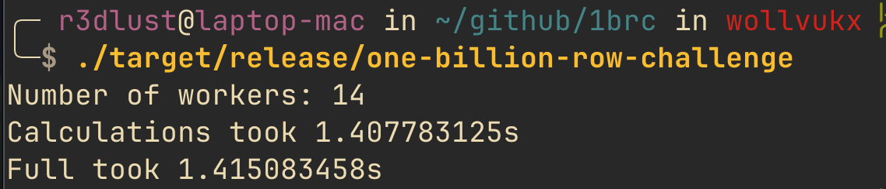
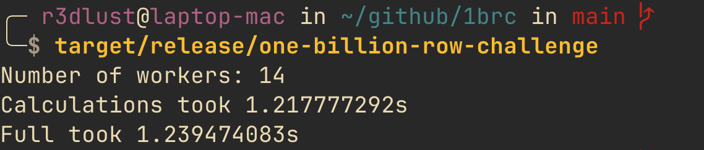

# one billion rows, zero platform intrinsics

about a year ago, my algorithms professor handed out a challenge: parse a file of weather station measurements, compute min/max/average per station, output sorted. then he mentioned it was a billion rows.

i spent a few weeks thinking about what the problem actually required. came out with something that runs in under 1.5 seconds on my M3 Max, no platform intrinsics.

## the problem

the [one billion row challenge](https://github.com/gunnarmorling/1brc) started as a java challenge in early 2024. the rules: a text file, 1 billion lines, each formatted as `<station name>;<temperature>`. compute min/mean/max per station, print alphabetically sorted.

it's a map-reduce problem with a fixed, known dataset: ~413 unique station names, temperatures between -99.9 and 99.9 with one decimal place.

### the dataset

the file is roughly 13GB uncompressed. the repo includes a generator:

```bash title="terminal"
cargo run --example generate 1000000000
```

### what knowing the dataset unlocks

there are always ~413 stations and the file divides cleanly. not assumptions you'd make in a general-purpose tool, but here they're free wins.

## getting started

```bash title="terminal"
git clone https://github.com/GustavoWidman/1brc
cd 1brc
cargo run --release
```

`.cargo/config.toml` sets `target-cpu=native` globally. build and benchmark on the same machine.

## bypassing the kernel with memmap2

the first question was how to read the file. `BufReader` copies kernel buffers into userspace on every read. `memmap2` skips that: the file maps directly into the process address space, the OS pages it on demand.

```rust title="file.rs"
pub fn open(path: &str) -> anyhow::Result<Self> {
    let file = std::fs::File::options().read(true).open(path)?;
    Ok(Self {
        mmap: Arc::new(unsafe {
            memmap2::MmapOptions::new().huge(None).map(&file)?
        }),
    })
}
```

the `huge(None)` hint requests transparent huge pages where available, which cuts TLB pressure on large sequential reads.

## never parse a float you don't need to

temperatures like `-12.3` only ever appear with one decimal place. no reason to touch `f64`. store them as `i16` times 10 and divide by 10 at output only. integer arithmetic is faster and `i16` is half the size of `f32`.

```rust title="file.rs"
fn parse_fake_float(mut bytes: &[u8]) -> i16 {
    let negative = unsafe { *bytes.get_unchecked(0) } == b'-';
    if negative {
        bytes = &unsafe { bytes.get_unchecked(1..) };
    }
    let mut val = 0i16;
    for &byte in bytes {
        if byte == b'.' { continue; }
        val = val * 10 + (byte - b'0') as i16;
    }
    if negative { -val } else { val }
}
```

the measurement struct is `min: i16`, `max: i16`, `sum: i64`, `count: usize`. `i64` on the sum prevents overflow across a billion additions. the divide-by-10 happens once in `into()`.

### fitting in cache

24 bytes per measurement entry, pre-allocated to `STATIONS_IN_DATASET * 2 = 826` slots. the whole table fits in a couple of cache lines during the merge phase.

## parallel chunking with rayon

the file splits into equal-sized chunks, one per worker. the catch is alignment: you can't cut at an arbitrary byte offset without splitting a line, so each chunk boundary scans forward to the next newline:

```rust title="file.rs"
fn chunk_file(&self) -> Vec<&[u8]> {
    let chunk_size = total_size / NUM_WORKERS;
    let mut start = 0;

    while start < total_size {
        let mut end = (start + chunk_size).min(total_size);
        if end < total_size {
            while end < total_size && buffer[end] != b'\n' {
                end += 1;
            }
            end += 1;
        }
        chunks.push(&buffer[start..end]);
        start = end;
    }
}
```

`NUM_WORKERS` is hardcoded to 14, the M3 Max core count. each chunk runs on its own thread via rayon and produces a local hashmap. merge at the end:

```rust title="file.rs"
let measurements = chunks
    .into_par_iter()
    .map(|chunk| Self::parse_buffer(chunk))
    .reduce(
        || HashMap::new(),
        |mut left, right| { left.merge(right); left },
    );
```

### the merge

`merge` iterates the smaller map and folds each entry into the accumulator. all keys are station names bounded to ~413, so the merged map never resizes.

## the hashmap

`hashbrown` with `ahash`, pre-sized to `STATIONS_IN_DATASET * 2`:

```rust title="hashmap.rs"
pub fn new() -> Self {
    Self {
        inner: InnerHashMap::with_capacity_and_hasher(
            STATIONS_IN_DATASET * 2,
            ahash::RandomState::new(),
        ),
    }
}
```

`hashbrown` resizes when load factor hits 0.875. at 826 slots for 413 keys, the map never rehashes across a billion insertions.

### memchr for the hot loop

finding the semicolon on every row is the hottest single operation. `memchr` does it in two lines. AVX2 on x86, NEON on arm, no architecture-specific code on my end:

```rust title="file.rs"
let comma_separator = memchr::memchr(b';', &buffer).unwrap();
let end = memchr::memchr(b'\n', &buffer[comma_separator..]).unwrap();
```

## where it landed

on my M3 Max (14 cores), warm cache: **~1.4 seconds**.



no platform intrinsics, no unsafe hot path. just the right abstractions doing their job.

## an autonomous agent takes a swing

near the end of the project's first year, a friend was testing an early version of an autonomous coding agent he's been building, a project he hasn't shipped yet. he pointed it at this repo with a "make it better" prompt and let it run.

the agent came back claiming 18.2 seconds to 1.66 seconds, a 110x speedup. the commit message was confident. the changes were 100% x86_64 platform intrinsics, completely incompatible with my M3 Max. it ran, but on scalar fallbacks.

a follow-up PR added proper aarch64 support. that one actually ran natively.



the result: 1.415s to 1.240s. 0.2 seconds over the generalist version, only after two PRs and needing platform-specific intrinsics to get there. the agent isn't public yet, but i'm watching it. the original "110x" claim lives on in git history.

## where it breaks

`NUM_WORKERS = 14` is hardcoded. running on a different machine won't adapt.

the hashmap is pre-sized for 413 known stations. a different dataset with more unique keys causes rehashing.

malformed input produces wrong output, no panic, no error.

this is a benchmarking tool, not a general-purpose one. it only works because i know exactly what the input looks like.

code is here: [github.com/GustavoWidman/1brc](https://github.com/GustavoWidman/1brc)
