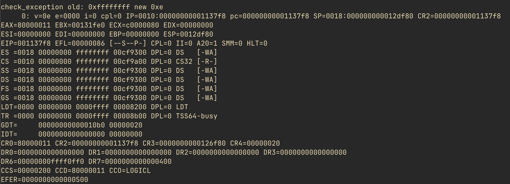
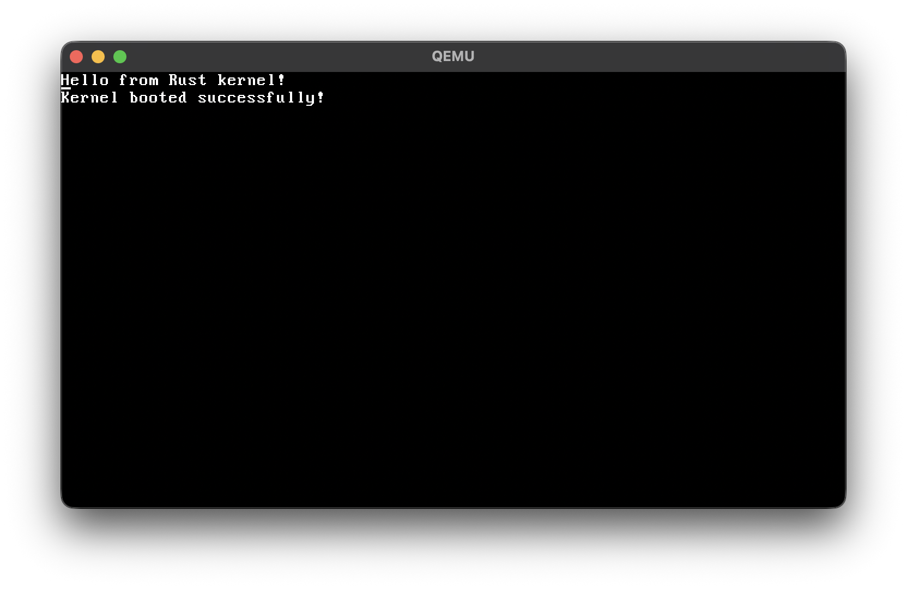
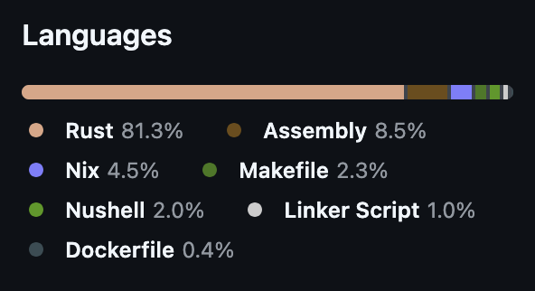

# writing a 64-bit os from scratch to dodge homework

it started as a standard homework assignment for my computer systems class: write a simple 32-bit x86 bootloader that could be booted by grub's multiboot.

my teacher provided [a guide](https://firelink-library.github.io/siscomp/bootloader/) and expected us to hook the bootloader into a c program that would host a tiny game. but i hate writing c. i asked if i could hook it into a rust program instead, purely rust. he said yes. i knew that rust functions could easily be exposed to assembly using the `extern "C"` keyword, so how hard could it be?

little did i know that seemingly innocent decision would turn into a massive rabbit hole of cpu registers, interrupt queues, and allocator hacks.

## the 32-bit trap

the moment i sat down to write it, i hit a wall. i started researching the c version and realized it drops you right into 32-bit protected mode. the problem? rust doesn't have a built-in target for 32-bit bare metal. it natively supports `x86_64-unknown-none` for 64-bit, but `i686-unknown-none` is nowhere to be found.

### the custom target dilemma

the standard advice on stack overflow and the rust forums was to just define a 32-bit target by hand. you basically write a custom `target.json` specification file and feed it to the compiler.

at the time, it felt incredibly unofficial. maintaining a custom compiler target just to do my homework felt like a band-aid over a bullet wound.

### choosing the harder path

i decided that relying on an undocumented json hack wasn't the right way to do it. instead, i challenged myself to use the official, native `x86_64-unknown-none` target. this meant i couldn't just write rust immediately. i had to actually understand how the assembly worked, hijack the boot process, and write the glue code to transition the cpu from 32-bit to 64-bit long mode before rust could even take over.

## flipping the magic cpu bits

the first real failure in the assembly was realizing you can't just flip a switch to enter 64-bit mode. the cpu demands that paging is enabled first. and to enable paging, you need page tables.

### identity mapping a gigabyte

i had to build the page map level 4 (pml4), the page directory pointer table (pdpt), and the page directory (pd). i ended up just identity mapping the first 1gib of memory using huge 2mib pages to keep it simple.

```asm title="boot.asm"
; PDPT[0] -> PD
    mov eax, pd
    or eax, 0x03
    mov [pdpt], eax

; identity map first 1gib using 2mib pages
    mov ecx, 0
    mov eax, 0x83
.map_pd:
    mov [pd + ecx * 8], eax
    add eax, 0x200000
    inc ecx
    cmp ecx, 512
    jne .map_pd
```



a screenshot of qemu rebooting endlessly because my initial page table setup was slightly misaligned.

### the four registers of the apocalypse

this was easily the hardest part. it took the longest to debug because if you get one bit wrong, the cpu triple-faults and reboots instantly with zero error logs.

to get into long mode, you have to load the page tables into `cr3`, enable physical address extension (pae) in `cr4`, enable long mode in the efer msr, and finally enable paging in `cr0`. after a far jump into a new global descriptor table (gdt), the cpu pipeline flushes and we drop right into `extern "C" fn main()`.

```asm title="boot.asm"
    lgdt [gdt.ptr]            ; load gdt
    jmp 0x08:long_mode        ; far jump to 64-bit code

    bits 64
long_mode:
    xor ax, ax
    mov ss, ax
    mov ds, ax
    mov es, ax

    call main
```

`call main`. absolute cinema. nothing quite beats the feeling of dropping straight from raw, unsafe assembly into the warm embrace of the rust compiler.



a screenshot of the qemu vga buffer printing "hello from rust kernel", proving the transition actually worked.

## building the game the right way

once the environment was set up, i got to write pure, idiomatic 64-bit rust. the assignment was to build a tiny game, so i built an interactive tic-tac-toe clone. but doing it the "right" way in a bare-metal environment required a few neat architectural choices.

### allocating memory from thin air

you can't use dynamically sized data structures like `Vec` or `String` in `no_std` rust without a heap allocator. instead of writing a naive bump allocator, i used an arena allocator called `talck` mapped to a static 64kb array.

```rust title="main.rs"
// 64kb heap arena
static mut ARENA: [u8; 65536] = [0; 65536];

#[global_allocator]
static ALLOCATOR: Talck<spin::Mutex<()>, ClaimOnOom> =
    Talc::new(unsafe { ClaimOnOom::new(Span::from_array(core::ptr::addr_of!(ARENA).cast_mut())) })
        .lock();
```

this instantly unlocked the `alloc` crate. in a `no_std` environment, the compiler won't even let you use dynamically sized types like vectors or strings without a global allocator defined. providing this static arena meant the linker finally stopped yelling at me.

### interrupt-driven keyboard events

the naive way to handle keyboard input in a game loop is to just poll the keyboard port constantly. "is key pressed? no. is key pressed? no." it's a massive waste of cpu cycles.

instead, i set up hardware interrupts. when a key is pressed, the cpu stops what it's doing, fires an interrupt, and pushes a `Play` event into a thread-safe `EVENT_QUEUE` vector.

```rust title="keyboard.rs"
pub static ref EVENT_QUEUE: RwLock<Vec<Play>> = RwLock::new(Vec::new());

pub fn handle_keyboard_interrupt(scancode: u8) {
    let mut keyboard = KEYBOARD.lock();

    if let Ok(Some(key_event)) = keyboard.add_byte(scancode) {
        if key_event.state == pc_keyboard::KeyState::Down {
            match key_event.code {
                KeyCode::Key1 => (*EVENT_QUEUE.write()).push(Play::One),
                // ...
            }
        }
    }
}
```

the main game loop then just sleeps, wakes up occasionally, drains the queue, updates the state, and redraws the vga buffer. it's the smart way of doing it, and it feels much closer to a modern event-driven architecture than a busy-looping toy.

## why "based-kernel"?

if you're wondering about the repository name, just look at the github language breakdown. the entire thing is glued together with rust, assembly, nix, and nushell.



an absolutely based stack.

## what this cost me

the main tradeoff here was the sheer amount of friction in debugging assembly. one wrong bit shift in the page tables and the machine just resets.

looking back, if i had to do it all over again, i'd probably just swallow my pride and use the custom `target.json` for 32-bit. it would have made the integration vastly simpler and shrunk the assembly code down to almost nothing.

## wrapping up

sometimes the "right" way isn't the most efficient way. hand-rolling a 32-to-64-bit transition taught me more about the cpu architecture than any textbook ever could, but it was absolute overkill for a homework assignment.

the caveat: if you just want to get your rust code running on a weird architecture, a custom json target is completely fine. but if you want to suffer and learn exactly how long mode actually initializes, writing it by hand is an incredible experience. you can check out the full code in the [based-kernel repository](https://github.com/GustavoWidman/based-kernel).
