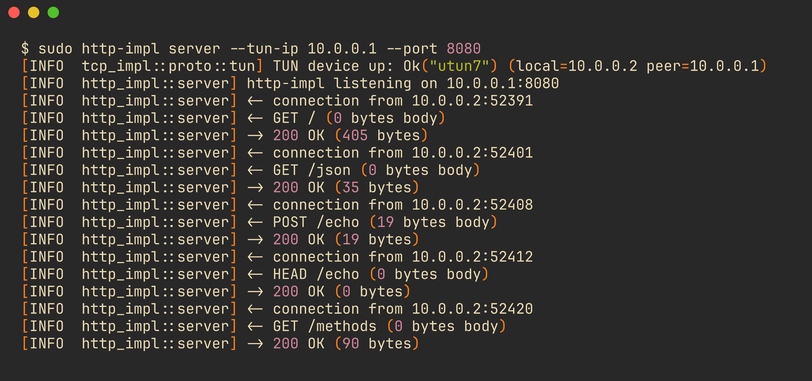
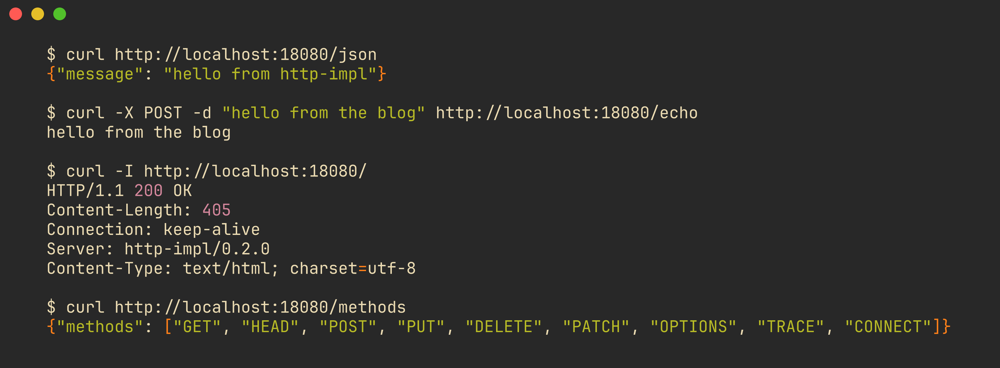
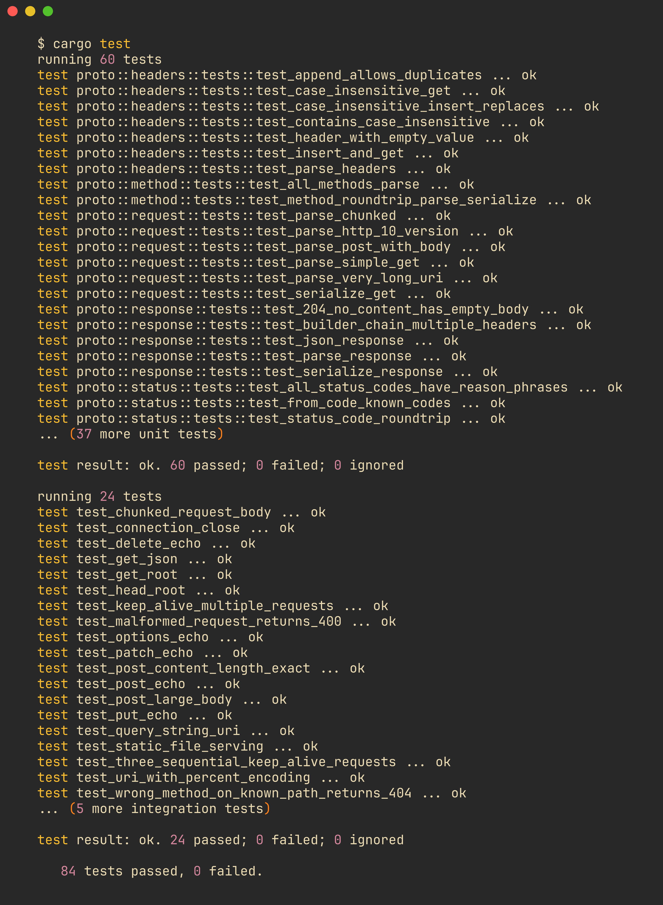

# building http/1.1 on a tcp stack i wrote myself

i finished [tcp-impl](https://blog.guswid.com/tcp-impl) and had a working TCP state machine running over a TUN device. three-way handshake, data transfer, graceful close. the whole happy path.

naturally, i looked at it and thought: "what if i parse HTTP on top of this?"

this is the story of http-impl, a from-scratch HTTP/1.1 client and server with zero external HTTP dependencies, running on top of my custom TCP stack. it took about two hours to get the first version working and another few hours of chasing bugs that were, in hindsight, completely predictable.

## the idea

tcp-impl gives you a `TcpConnection` that can read and write bytes over a TUN interface. that's all HTTP needs. the protocol is text-based (mostly), well-documented (RFC 7230/7231), and old enough to have plenty of reference material.

the plan was simple:

1. parse HTTP request lines, headers, and bodies from raw bytes
2. build a server that routes requests to handlers
3. build a client that constructs and sends requests
4. do all of this without pulling in hyper, reqwest, or any other HTTP crate

the only external dependency for protocol work is tcp-impl itself. everything else (clap for CLI, colored for terminal output, env_logger) is just scaffolding.


the landing page, served by http-impl over kernel TCP. no nginx, no hyper, no framework. just bytes parsed by hand.

## parsing http by hand

### the request parser

an HTTP/1.1 request looks like this on the wire:

```
GET /path HTTP/1.1\r\n
Host: localhost\r\n
Content-Length: 11\r\n
\r\n
hello world
```

request line, then headers (each ending with `\r\n`), then a blank line, then maybe a body. parsing this is mostly string splitting, but there are enough edge cases to keep you honest.

```rust title="request.rs"
pub fn parse(buf: &[u8]) -> ParseResult {
    // find the end of the request line
    let req_line_end = match find_subsequence(buf, b"\r\n") {
        Some(pos) => pos,
        None => return ParseResult::Partial,
    };

    // parse: METHOD SP URI SP HTTP-Version
    let mut parts = req_line.splitn(3, ' ');
    let method_str = parts.next()?;
    let uri = parts.next()?;
    let version = parts.next()?;

    // ... parse headers, then body based on Content-Length or chunked
}
```

the parser returns one of three states: `Complete(request, bytes_consumed)`, `Partial` (need more data), or `Error`. this three-state model turned out to be the right call. when you're reading from a TUN device that delivers data in IP-packet-sized chunks, you almost always get `Partial` on the first read.

### chunked transfer encoding

i almost skipped this. then i realized half the internet uses it.

chunked encoding sends the body as a series of hex-length-prefixed chunks, terminated by a zero-length chunk:

```
5\r\n
hello\r\n
6\r\n
 world\r\n
0\r\n
\r\n
```

the parser walks through each chunk, reads the hex size, grabs that many bytes, and repeats until it hits `0\r\n`. chunk extensions (the stuff after a semicolon in the size line) are parsed but ignored, which is compliant per RFC 7230.

```rust title="request.rs"
let size_str = size_line
    .iter()
    .position(|&b| b == b';')
    .map_or(size_str, |pos| &size_str[..pos]);

let chunk_size = usize::from_str_radix(size_str.trim(), 16)?;
```

### the response builder

responses use a builder pattern. nothing fancy, but it makes the routing code readable:

```rust title="response.rs"
Response::new(StatusCode::Ok)
    .header("Content-Type", "application/json")
    .body(json_bytes)
```

every response automatically gets `Content-Length`, `Connection: keep-alive`, and a `Server` header. custom headers skip those three to avoid duplicates.

## the server

the server has a simple routing model: register handlers by method and path, then dispatch incoming requests.

```rust title="server.rs"
let mut server = Server::new();
server.route(Method::Get, "/json", |_| {
    Response::ok_json("{\"message\": \"hello from http-impl\"}")
});
server.any("/echo", |req| {
    Response::new(StatusCode::Ok)
        .header("Content-Type", req.headers.get("Content-Type").unwrap_or("application/octet-stream"))
        .body(req.body.clone())
});
```

there's also static file serving with MIME type detection and directory traversal protection (checking for `..` in paths). it handles the common file types: html, css, js, json, images, svg.

### built-in routes

the server ships with a few demo endpoints out of the box:

- `GET /` returns an HTML page with links to everything else
- `GET /json` returns a JSON object
- `GET /headers` echoes your request headers back as JSON
- `GET /methods` lists all supported HTTP methods
- `* /echo` echoes back whatever body you send, with any method

these exist partly for testing and partly because a server that returns nothing is useless for debugging.

## the tun device bug (round one)

this is where things got interesting. the server worked over kernel TCP on the first try. over TUN, it accepted one connection and then went silent.

### what happened

the original code created a new `TunDevice` inside `handle_connection`:

```rust
// the bug: this creates tun1, but traffic goes to tun0
fn handle_connection(&self, conn: &mut TcpConnection) {
    let mut tun = TunDevice::new(&self.tun_ip.to_string()).unwrap();
    // read/write on tun1... but the kernel sends packets to tun0
}
```

the `TcpListener` had already created a TUN device (tun0) and accepted the connection on it. but `handle_connection` created a second TUN device (tun1). the kernel's routing table still pointed to tun0, so all incoming packets went there. tun1 never saw anything.

the connection would establish (the handshake happened on tun0 inside the listener), then immediately go dark because the handler was reading from the wrong interface.

### the fix

pass the TUN device from the listener into the handler:

```rust title="server.rs"
let mut tun = TunDevice::new(&tun_ip.to_string())?;

while !shutdown.load(Ordering::Relaxed) {
    let mut listener = TcpListener::new(tun, tun_ip, port);
    let mut conn = listener.accept(shutdown.clone())?;

    // recover the SAME tun from the listener
    tun = listener.into_tun();

    self.handle_connection(&mut conn, &mut tun, &shutdown)?;
    // tun is still alive, loop back for the next connection
}
```

`TcpListener::new` is lightweight; it just wraps the existing TUN in a struct without any system calls. `into_tun()` consumes the listener and gives the TUN device back. this way, one TUN device lives for the entire server lifetime, and every connection reads/writes on the same interface.


the server log after fixing the TUN lifecycle: connections accepted, requests dispatched, responses sent.

## the tun device bug (round two): the 10-second stall

after fixing the TUN reuse, the server worked, but with a catch: there was a 10-second gap between responding to one request and being able to accept the next one.

### the polling loop from hell

the original `read_into_buffer` was designed for keep-alive. after sending a response, it would wait for more data on the same connection, expecting pipelined requests:

```rust
// 200 attempts * 50ms = 10 seconds of waiting for nothing
let max_attempts = 200;
for _ in 0..max_attempts {
    match conn.read(tun)? {
        Some(data) => { buffer.extend_from_slice(&data); return Ok(true); }
        None => { std::thread::sleep(Duration::from_millis(50)); continue; }
    }
}
```

in kernel TCP mode, this would be fine. the OS handles multiplexing, and you can have multiple connections open at once. but TUN mode is fundamentally single-threaded: one TUN device, one connection at a time. while we're sitting in this loop waiting for a second request that will never come, no new connections can be accepted.

### the fix

kill keep-alive in TUN mode entirely. process exactly one request-response exchange per connection, then close:

```rust title="server.rs"
// TUN mode: one request, one response, close.
let got_data = self.read_into_buffer(conn, tun, &mut buffer, shutdown)?;
// ... parse and respond ...
// close immediately, no keep-alive loop
if conn.state == TcpState::Established || conn.state == TcpState::CloseWait {
    if let Some(TcpAction::Send(hdr, payload)) = conn.close() {
        // send FIN
    }
}
```

the polling timeout was also reduced from 10 seconds (200 _ 50ms) to 1 second (20 _ 50ms), which is more than enough for data arriving over a local TUN interface.

## dual transport: tun vs kernel tcp

after the TUN bugs, i added kernel TCP as a first-class transport mode. not as a fallback, but as a proper alternative with its own advantages.

### kernel tcp mode

```rust title="server.rs"
pub fn listen_kernel_tcp(self: Arc<Self>, port: u16, shutdown: Arc<AtomicBool>) {
    let listener = StdTcpListener::bind(("0.0.0.0", port))?;
    listener.set_nonblocking(true)?;

    while !shutdown.load(Ordering::Relaxed) {
        match listener.accept() {
            Ok((stream, addr)) => {
                let server = Arc::clone(&self);
                std::thread::spawn(move || {
                    server.handle_kernel_tcp_connection(stream, &shutdown)?;
                });
            }
            Err(ref e) if e.kind() == ErrorKind::WouldBlock => {
                std::thread::sleep(Duration::from_millis(10));
            }
            // ...
        }
    }
}
```

each accepted connection gets its own thread. the server is wrapped in `Arc<Self>` so it can be shared safely. kernel TCP mode supports full keep-alive, so multiple requests can flow over a single connection without the TUN serialization constraint.

### why both modes exist

TUN mode is the point of the project: HTTP running on a TCP stack i wrote, running on a virtual network interface. it proves the whole stack works end-to-end.

kernel TCP mode exists for practical reasons:

- testing without root privileges (TUN requires sudo)
- concurrent connections (thread-per-connection)
- interop testing against real HTTP clients (curl, browsers)
- running the integration test suite in CI

the CLI makes it easy to switch:

```bash
# tun mode (needs sudo)
sudo ./target/release/http-impl server --tun-ip 10.0.0.2 --port 8080

# kernel tcp mode (no sudo needed)
./target/release/http-impl server --kernel-tcp --port 8080
```

## the client

the client is simpler than the server. it parses a URL, opens a TCP connection (TUN or kernel), sends a serialized request, and reads the response.

```rust title="client.rs"
pub fn send_request_kernel_tcp(
    url: &str, method: Method, headers: &[(String, String)], body: Option<&str>
) -> std::io::Result<ClientResponse> {
    let (host, port, path) = parse_url(url)?;
    let addr = resolve_host(&host, port)?;
    let mut stream = TcpStream::connect(addr)?;

    let request = build_request(method, &path, &host, headers, body);
    stream.write_all(&request.serialize())?;

    // read response...
}
```

one thing that tripped me up: the `Host` header needs the original hostname, not the resolved IP. i initially used the IP address, which works for most servers, but it's wrong per RFC 7230. if you're hitting a virtual-hosted server, the Host header is how it knows which site you want.


curl against the running server, showing json, echo, head, and methods responses.

## the architecture

after a round of modularization, the project structure mirrors tcp-impl:

```
src/
├── lib.rs                  # library root with re-exports
├── server.rs               # http server (tun + kernel tcp)
├── client.rs               # http client
├── bin/http-impl/
│   ├── main.rs             # cli entry point
│   └── cli.rs              # clap argument parsing
└── proto/
    ├── mod.rs              # protocol module exports
    ├── request.rs          # request parsing + serialization
    ├── response.rs         # response builder + parsing
    ├── headers.rs          # header collection (case-insensitive)
    ├── method.rs           # GET, POST, PUT, DELETE, etc.
    └── status.rs           # 200 OK, 404 Not Found, etc.
```

the binary is a thin CLI wrapper. all HTTP logic lives in the library crate, so you could use http-impl as a dependency in another project if you wanted to (not that you should in production, but you could).

### what the library exports

```rust title="lib.rs"
pub use proto::request::{ParseResult, Request};
pub use proto::response::Response;
pub use proto::headers::Headers;
pub use proto::method::Method;
pub use proto::status::StatusCode;
pub use server::Server;
```

top-level re-exports so consumers don't need to navigate the module hierarchy. same pattern as tcp-impl.

## what's missing (on purpose)

this is happy-path HTTP/1.1. things i deliberately skipped:

- **TLS**: no HTTPS. adding rustls would be straightforward but beside the point.
- **HTTP/2**: binary framing, HPACK, multiplexing. a different project entirely.
- **pipelining**: the spec allows it, but in practice even browsers don't use it.
- **100 Continue**: the server doesn't send intermediate status codes.
- **trailers**: chunked encoding trailers are parsed but discarded.
- **range requests**: no partial content support.
- **compression**: no gzip/deflate/brotli. bytes go out as-is.

the goal was to understand how HTTP works at the wire level, not to replace nginx.

## what i learned

building HTTP on top of a TCP stack you wrote yourself gives you a perspective you can't get from reading RFCs alone. you feel every abstraction boundary, because you built every abstraction boundary.

the TUN device bugs were the most educational part. the first one (creating a new TUN per connection) was a resource lifecycle problem that would never happen with kernel sockets, because the OS manages that for you. the second one (keep-alive polling blocking new connections) was a concurrency model problem: TUN is inherently serial, and pretending otherwise wastes 10 seconds per request.


84 tests, all green.

the progression from [udp-impl](https://blog.guswid.com/udp-impl) to [tcp-impl](https://blog.guswid.com/tcp-impl) to http-impl has been a vertical slice through the network stack. each layer adds complexity, but each layer also makes the one below it more concrete. i understand TCP better now because i've seen what it looks like from HTTP's perspective.

was it worth building HTTP from scratch? yes. would i use this in production? absolutely not. and that's the right answer for a project like this.

the code is at [github.com/GustavoWidman/http-impl](https://github.com/GustavoWidman/http-impl).
