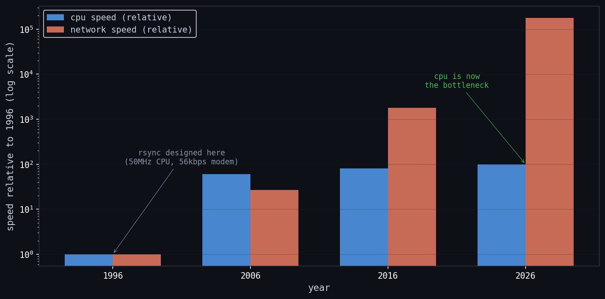
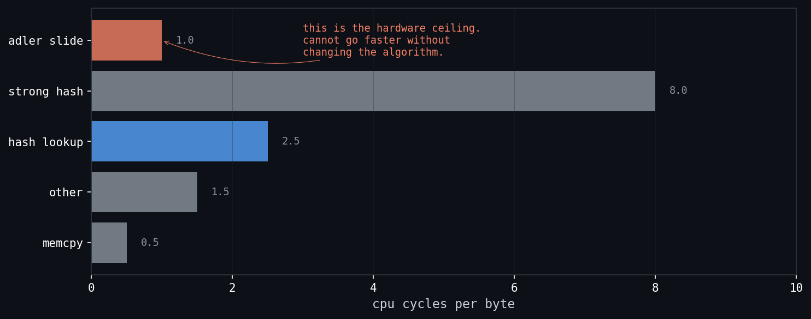
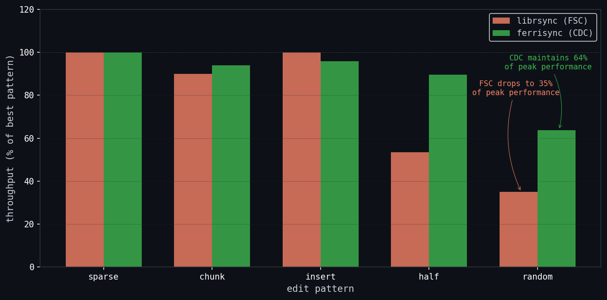

# o problema do rsync em 2026

no início de 2024, eu estava construindo uma ferramenta de sincronização de arquivos em rust. nada fancy. apenas algo para manter meu desktop e laptop sincronizados sem precisar pensar nisso. as coisas estavam correndo bem até que fiz uma pergunta que consumiria os próximos dois anos da minha vida:

"eu realmente vou re-transferir o arquivo inteiro toda vez que mudá-lo?"

eu sabia que o git não fazia isso. eu sabia que o `rsync` existia. então mergulhei em como algoritmos de diferencial de arquivos realmente funcionam.

o que encontrei me chocou.

o algoritmo rsync, escrito por andrew tridgell em 1996, foi benchmarkado em uma **CPU SPARC 10 de 50MHz rodando SunOS**. ele usa MD4 como hash forte. é single-threaded. e de alguma forma, quase três décadas depois, ainda é a espinha dorsal de como sincronizamos arquivos. o `fast_rsync` do dropbox, seu software de backup, provedores de cloud storage, todos traçam sua linhagem de volta a esse algoritmo.

nossas redes ficaram mais rápidas. nossas cpus ficaram mais rápidas. mas o software? ainda rodando a mesma matemática de 1996.



o gap entre CPUs de 50MHz e redes de 10Gbps é onde o problema vive.

## o gargalo de rede morreu

historicamente, o rsync foi desenhado para redes lentas. modems. isdn. o algoritmo era inteligente porque minimizava o que você enviava pelo fio, mesmo que significasse queimar ciclos de cpu para descobrir o que mudou.

mas aqui está a coisa. em redes de fibra e gigabit+, esse tradeoff não faz mais sentido.

a cpu agora é o gargalo.

um paper de 2021 de he et al. (o projeto `dsync`) mediu isso explicitamente. em redes gigabit, ferramentas baseadas em rsync gastam **até 10× mais tempo casando blocos** do que realmente transmitindo dados. sua placa de rede fancy de 10gbps está sentada lá, entediada, enquanto sua cpu se arrasta por um scan byte-a-byte single-threaded.

esse é o gap. é aqui que o ferrisync vive.

## como o rsync realmente funciona (o deep dive)

para entender por que o rsync é cpu-bound, você precisa entender como ele funciona. vamos ficar técnicos.

o rsync usa o que chamamos de **fixed-size chunking (fsc)**. aqui está o algoritmo em duas fases:

### fase 1: geração de assinatura

o sender pega o arquivo "base" (a versão antiga) e divide em blocos de tamanho fixo. tipicamente 512 bytes ou algo similar. para cada bloco, ele computa:

1. um **checksum fraco**, um rolling hash (geralmente uma variante do adler-32) que é rápido de computar e pode ser "rolado" (atualizado incrementalmente quando bytes entram/saem da janela)
2. um **hash forte**, um hash criptográfico (historicamente MD4, implementações modernas usam blake3 ou xxhash) que identifica unicamente o bloco

essas assinaturas são enviadas para o receiver.

```rust title="signature.rs (conceitual)"
pub struct BlockSig<S, W> {
    pub index: usize,
    pub weak: W,    // rolling checksum
    pub strong: S,  // hash criptográfico
}
```

### fase 2: computação de delta

o receiver tem o arquivo "novo" e a tabela de assinaturas do arquivo antigo. agora precisa encontrar quais blocos do arquivo antigo ainda existem no arquivo novo.

é aqui que o rolling hash brilha. ao invés de comparar cada substring possível (que seria O(n²)), o receiver desliza uma janela byte-a-byte através do arquivo novo:

1. computa o checksum fraco para a janela atual
2. procura na tabela de assinaturas
3. se houver match, computa o hash forte para confirmar (hashes fracos colidem)
4. se confirmado, emite uma instrução "copie bloco X" e pula para frente
5. se não houver match, emite um byte literal e desliza a janela em um

```rust title="delta.rs (simplificado)"
while pos + block_size < new_data.len() {
    let weak = rolling.digest();

    if let Some(candidates) = lookup.get(&weak) {
        let strong_digest = strong.hash(&new_data[pos..pos + block_size]);
        if let Some(index) = find_match(candidates, strong_digest) {
            ops.push(DeltaOp::Copy { index });
            pos += block_size;  // pula para frente!
            continue;
        }
    }

    // sem match - desliza UM byte
    literal.push(new_data[pos]);
    rolling.roll_out(new_data[pos], block_size);
    rolling.roll_in(new_data[pos + block_size]);
    pos += 1;
}
```

a mágica está no passo 4. quando você encontra um match, pula um bloco inteiro. mas quando não há match, você avança apenas **um byte**.

### o custo escondido

esse "desliza um byte" é o matador. no pior caso, dois arquivos completamente diferentes, você está fazendo O(n) iterações onde n é o tamanho do arquivo. e cada iteração envolve:

- computar a atualização do rolling hash (rápido, mas ainda trabalho)
- uma lookup em hash table (acesso à memória, potencial cache miss)
- potencialmente computar um hash forte (caro)

é por isso que o rsync é cpu-bound. o algoritmo fundamentalmente requer tocar cada byte, mesmo quando nada combina.

## o teto do adler-32

o rolling checksum do rsync é uma variante do adler-32. é lindamente simples:

```rust title="adler.rs"
// alimenta um bloco inteiro
for &byte in buf {
    s1 = s1.wrapping_add(byte as u32);
    s2 = s2.wrapping_add(s1);
}

// desliza a janela (atualização O(1)!)
fn roll_out(&mut self, byte: u8, window_len: usize) {
    self.s1 = self.s1.wrapping_sub(byte as u32 + CHAR_OFFSET);
    self.s2 = self.s2.wrapping_sub(window_len as u32 * (byte as u32 + CHAR_OFFSET));
}
```

a linha `s2 += s1` cria uma dependência sequencial. você não pode paralelizar. não pode vetorizar. está preso computando um byte por vez.

no meu profiling, descobri que o loop de sliding window leva **exatamente um ciclo de cpu por iteração**. esse é o teto de hardware. você literalmente não pode ir mais rápido sem mudar o algoritmo.



é aqui que o fsc bate num muro.

## content-defined chunking: uma abordagem diferente

e se não usássemos blocos de tamanho fixo? e se os limites dos chunks fossem determinados pelo próprio conteúdo?

isso é **content-defined chunking (cdc)**, e é a abordagem usada por ferramentas modernas como `dsync` e sistemas de deduplicação.

### como cdc funciona

ao invés de dividir o arquivo no byte 0, 512, 1024, etc., cdc encontra limites olhando para os dados. uma abordagem comum é:

1. usar um rolling hash (como gear hash) para escanear o arquivo
2. quando o hash atende algum critério (ex: `hash & mask == target`), marca um limite
3. repete até o arquivo inteiro estar chunkado

o insight chave. **se dois arquivos compartilham conteúdo, esse conteúdo produzirá os mesmos limites de chunk**. mesmo se bytes foram inseridos ou deletados em outros lugares, as regiões que combinam serão chunkadas identicamente.

### por que cdc muda tudo

na fase de delta, cdc não precisa de uma sliding window byte-a-byte. você:

1. re-chunk o arquivo novo usando os mesmos parâmetros
2. procura o weak fingerprint de cada chunk diretamente
3. confirma com o hash forte se necessário

sem sliding. sem pior caso O(n). chunk, lookup, feito.

```rust title="cdc_chunk.rs (conceitual)"
pub struct CdcChunk<'a> {
    pub data: &'a [u8],
    pub weak_fp: u64,  // o gear hash no limite
}
```

o campo `weak_fp` é interessante. em implementações estilo fastcdc, o gear hash que determina o limite é reutilizado como o weak fingerprint. sem passada separada de adler-32.

### o tradeoff do cdc

cdc não é de graça. o chunking em si tem overhead. você ainda está escaneando o arquivo. mas o scan é previsível, vetorizável, e não tem a dependência sequencial que mata a sliding window do fsc.

a história real é mais nuançada do que "cdc é estável". pegue ram cdc, por exemplo. em edits esparsos, ela atinge o pico de throughput. em edits aleatórios, ainda cai para cerca de 64% do pico. isso é muito melhor que fsc (que cai para 35%), mas não é magia. cdc evita o fallback byte-a-byte o(n) que mata fsc, mas quando o arquivo novo não se parece nada com o antigo, você ainda está re-escaneando tudo.



fsc cai para 35% do pico em edits aleatórios. cdc mantém 64%. ainda assim, uma diferença enorme.

## os vetores de ataque

então se queremos modernizar o rsync, onde atacamos? a literatura aponta para três camadas integradas:

### 1. aceleração simd

cpus modernas têm instruções vetoriais (sse, avx, neon) que podem processar múltiplos bytes simultaneamente. o problema. o adler-32 do rsync é fundamentalmente sequencial.

mas cdc muda o jogo. alguns algoritmos de chunking (como ram cdc, que usa extremos de bytes locais ao invés de hashes) são altamente receptivos a simd. um paper de 2025 (vectorcdc) demonstrou **~30 GB/s** de throughput de chunking usando avx-512 em algoritmos hashless.

até rolling hashes podem ser paralelizados com truques modernos. ss-cdc (2019) e odess (2023) mostraram que rolling hashes "inerentemente sequenciais" podem usar sliding windows vetorizadas para processar múltiplas posições simultaneamente.

### 2. paralelização multi-core

rsync é single-threaded. mas chunking? geração de assinatura? matching de blocos? esses são problemas vergonhosamente paralelizáveis.

divida o arquivo em regiões, processe cada uma em um core separado, mescle resultados. o desafio é fazer isso sem introduzir overhead de sincronização que coma seus ganhos.

### 3. estruturas de dados cache-friendly

a tabela de assinaturas é um hash map. todo match de bloco requer uma lookup. em cpus modernas, um cache miss é ~100x mais lento que um cache hit.

a abordagem default, usar um hash map de propósito geral com seu próprio hashing interno, significa que estamos hasheando valores já hasheados. nossos weak digests são inteiros uniformemente distribuídos. por que hash de novo?

um hash map customizado com um no-op hasher e layout otimizado para cache poderia reduzir significativamente a latência de memória.

## por que isso importa

provedores de cloud storage. sistemas de backup. data centers. qualquer um movendo arquivos em redes rápidas. todos estão pagando por ciclos de cpu que não deveriam ser necessários.

se o rsync permanecer um gargalo de cpu, estamos deixando banda na mesa. rodando mais servidores do que precisamos. desperdiçando energia.

as técnicas existem isoladamente. chunking simd, delta compression paralelo, lookups cache-otimizados. mas nunca foram unificadas em uma implementação rsync única e coesa.

esse é o gap. essa é a tese.

## o que o ferrisync é (e não é)

ferrisync é uma implementação em rust de sincronização de arquivos estilo rsync, desenhada para explorar até onde otimizações de hardware podem empurrar o throughput.

é um projeto de pesquisa. uma tese. um playground para tentar coisas que podem não funcionar.

o código é modular por definição. troque o weak hash, troque o strong hash, troque a estratégia de chunking. benchmarque tudo. encontre os gargalos.

é também uma jornada pessoal. tentei isso em 2024 e falhei. era inexperiente demais, não sabia perfilhar, não entendia simd. deixei de lado, frustrado mas obcecado.

agora é 2026. passei dois anos ficando bom em rust. ensinei rust para meus colegas de classe. construí as skills para realmente atacar esse problema.

ferrisync é o que acontece quando você se recusa a deixar um problema ir.

## o que vem a seguir

esse post é uma introdução. os deep dives técnicos estão vindo:

- a implementação fsc e o paradoxo do loop unrolling
- os experimentos cdc: fastcdc, ram cdc, e além
- aceleração simd: onde funciona e onde não funciona
- o zoológico de strong hashes: md4, blake3, museair, gxhash
- metodologia de benchmark e resultados reprodutíveis

a tese está em andamento. o código está evoluindo. mas a pergunta é clara:

**podemos fazer o rsync rápido o suficiente para realmente usar nossas redes?**

eu acho que a resposta é sim.
