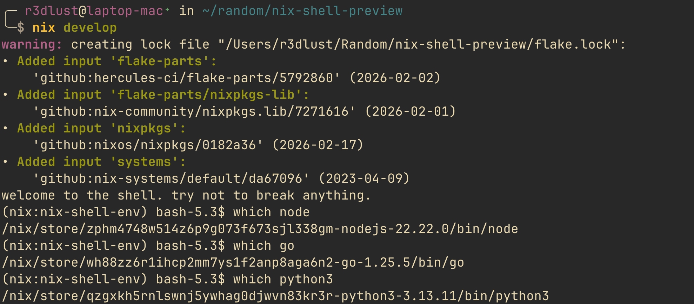

# escaping dependency hell by over-engineering my entire life

look, i didn't set out to build a fully declarative, reproducible, portable development environment that spans 457 commits and 7 months of my life. i just wanted to write code without having to spend the first three hours of my day fighting with my system's python version.

we've all been there. you pull a repo, run `npm install` or `pip install`, and suddenly your operating system is complaining that you have the wrong version of openssl installed in `/usr/lib`. so what do you do? you reach for docker.


you spin up an entire virtualized linux kernel, drag around a 2gb image, and pretend that shipping a whole-ass operating system just to run a node.js server is a "best practice". it's garbage. docker is a band-aid over a fundamentally broken system. it's like buying a new house every time your sink gets clogged.

that's why i ended up looking into nix. i was annoyed, i was lazy, and i hate virtualization when it's not needed. why do i need to simulate a hard drive and a network interface just to ensure a javascript package has the right native bindings? it made no sense to me.

## what even is nix? (no, seriously)

before we get into the weeds of how i completely over-engineered my infrastructure, let's get our terminology straight. the naming convention in the nix ecosystem is arguably the worst part of it. when people say "nix", they could mean three different things.


first, there's `nix` the package manager. this is the actual tool you run on your terminal. it's a piece of software that can be installed on pretty much any linux distribution or macos (or windows via wsl). it manages packages, builds software, and handles dependencies.

second, there's nix the language (often referred to as the nix expression language). it's a purely functional, lazily evaluated language designed specifically for declaring packages and configurations. it looks a bit like json and has the syntax of a math equation written by someone who really loves curly braces and semicolons.

third, there's nixos. this is an entire linux distribution built around the nix package manager. in nixos, everything, from the kernel to the `/etc/passwd` file to your desktop environment, is declared using the nix language and managed by the nix package manager.

they are related, but they are not the same. you don't need nixos to use the nix package manager. you can use nix on your existing macbook today.

## killing the fhs

so what makes nix so special? it all comes down to the filesystem.

most unix-like systems follow the filesystem hierarchy standard (fhs). this means binaries go in `/usr/bin`, libraries go in `/usr/lib`, and configuration goes in `/etc`. this is a global, mutable state. if application a needs `libfoo.so` version 1, and application b needs `libfoo.so` version 2, you have a problem. they both want to live in `/usr/lib`. this is the root cause of dependency hell. you end up symlinking things randomly, editing `$LD_LIBRARY_PATH` in your `.bashrc` like an animal, and praying it doesn't break something else.

nix says "screw the fhs". instead, it has the nix store, usually located at `/nix/store`. every package, every library, every configuration file is built and stored in a directory named with a cryptographic hash of all its inputs (source code, build scripts, dependencies).

### the beauty of cryptographic hashing

the beauty of this is reuse. if you have two entirely different projects that both require the exact same version of `bash` or `glibc`, nix doesn't download or build them twice. because the hash of the inputs is identical, they both simply point to the exact same derivation in the `/nix/store`. you get the isolation of docker without the massive duplication of shared libraries.

if you change a single bit of a dependency, the hash changes, and the package gets built in a completely new directory. this means you can have fifty different versions of python installed simultaneously, and they will never conflict. nothing is ever overwritten. your `/usr/lib` remains untouched.

### pure environments and the sandbox

this leads us to the concept of "pure" development environments. when you enter a nix shell, nix manipulates your `$PATH` and other environment variables to point exclusively to the packages in the nix store that you explicitly requested. it sandboxes your environment. if you didn't declare `curl` as a dependency, your build script won't be able to find it, even if it's installed globally on your system. this guarantees reproducibility. if it builds on my machine, it will build on your machine, period.

## the 500gb rust mistake

but there's a catch to this immutable nirvana. because nix never overwrites anything and builds everything in isolation, your `/nix/store` grows. and it grows fast.

nix handles this through garbage collection. it works similarly to memory management in programming languages. if a package in the store isn't referenced by any active environment or "gc root", it can be safely deleted.

a funny thing happened to me a while back. i was on my macos laptop, minding my own business on a random wednesday, and i noticed my disk space was dangerously low. i ran a disk analyzer and found out my `/nix/store` was sitting at over 500gbs!


now, remember how i said nix reuses identical derivations? well, it turns out that if you're writing a lot of custom tools using the nightly rust toolchain with custom targets, you're essentially generating a brand new hash every single day. the nightly compiler is a fast-moving target. every time i spun up a dev shell for a rust project, nix happily evaluated the new inputs, downloaded and compiled the newest nightly compiler, and created a massive, unique derivation in the store.

over months of not running the garbage collector, i had stockpiled every single iteration of the rust compiler known to man.


a quick `nix-collect-garbage -d` later, and i had my laptop back. it's a feature, not a bug, but it definitely requires some babysitting. you simply cannot let your machine run for months without cleaning up the store if you use fast-moving dependencies.

## escaping docker

let's look at a practical example of why nix natively is better than docker virtualization. at my university, i needed to run ros2 (robot operating system). historically, running ros2 meant you had to use ubuntu. if you were on a mac, you were out of luck.

### the ros2 networking nightmare

most people try to solve this with docker. but ros2 inside docker is an absolute nightmare, specifically because of networking.

ros2 relies heavily on dds (data distribution service) for node discovery. it wants to be natively on your host network to broadcast packets and find other robots or nodes. when you shove ros2 inside a virtualized docker network bridge, device discovery instantly breaks.

you end up having to write a slur of environment variables and custom xml profiles to patch the dds implementation just to get it to see devices on your local network. and even then, half the time it drops packets or simply refuses to acknowledge a node sitting three feet away from you.

### native execution to the rescue

i refused to switch to ubuntu and i refused to deal with docker networking garbage. instead, i built a reproducible ros2 environment using nix and pixi. you can check it out here: [ros2-humble-env](https://github.com/GustavoWidman/ros2-humble-env).

when a student clones that repo and runs `nix develop`, nix fetches all the exact dependencies, sets up the python environment, configures the cmake flags, and drops them into a shell where all the ros2 commands just work natively on their machine, even on macos.

no vms, no docker network bridges blocking dds discovery, no system contamination. the shell hook even runs pixi commands automatically on launch to handle some local python package weirdness. it was a massive success, purely because it eliminated the setup friction and the network virtualization layer for everyone in the class.

## getting started (without losing your mind)

if you want to try this, don't start by rewriting your entire operating system. start with a simple developer shell.

personally, i heavily prefer using `flake-parts`. a lot of older tutorials will point you towards `flake-utils`, but `flake-parts` using the `perSystem` module is much cleaner, reduces boilerplate, and scales infinitely better when your project grows.

here's all you need to jump-start a reproducible environment today. put this in a `flake.nix` file in your project root:

```nix title="flake.nix"
{
  description = "a sanity check dev environment";

  inputs = {
    nixpkgs.url = "github:nixos/nixpkgs/nixos-unstable";
    flake-parts.url = "github:hercules-ci/flake-parts";
    systems.url = "github:nix-systems/default";
  };

  outputs = inputs@{ flake-parts, systems, ... }:
    flake-parts.lib.mkFlake { inherit inputs; } {
      systems = import systems;

      perSystem = { pkgs, ... }: {
        devShells.default = pkgs.mkShell {
          packages = with pkgs; [
            nodejs_22
            python3
            go
          ];

          shellHook = ''
            echo "welcome to the shell. try not to break anything."
          '';
        };
      };
    };
}
```

run `nix develop` in that directory. nix will evaluate the flake, download exactly nodejs 22, python 3, and go, and drop you into a shell where those binaries exist. when you exit the shell, they disappear from your `$PATH`. your host system remains completely oblivious.



### bonus: keeping your precious shell

by default, `nix develop` drops you into the ugliest bash shell you've ever seen. if you're like me and have spent a millennia tinkering with your `zsh` or `nushell` config, this is mildly infuriating.

you _can_ use a dirty workaround to force nix to use your shell:

```bash
nix develop -c env $'SHELL=[YOUR_SHELL]' [YOUR_SHELL]
```

but be warned: this has issues. your environment isn't fully "sealed" anymore because it inherits garbage from your user's global config, which kind of defeats the purpose of a pure 'sandbox'.

the actual, civilized way to do this is with [direnv](https://direnv.net/). you install `direnv` and [nix-direnv](https://github.com/nix-community/nix-direnv) (to cache the evaluations and speed things up dramatically), drop an `.envrc` file in your project with the words `use flake`, and run `direnv allow`.

now, whenever you `cd` into your project directory, your familiar, heavily-customized shell automatically absorbs the nix environment variables in the background. no subshells, no bash fallback, just pure magic.

if you want to see how i actually set this up across my machines without losing my mind, you can check out my global direnv config [right here](https://github.com/GustavoWidman/nix/blob/main/modules/common/direnv.nix). it basically quiets direnv down a bit, enables `nix-direnv` and integrates directly with my shell (you might have to check my nushell files as well for the direnv hook). feel free to steal it.

## the bad parts (and there are many)

you might be thinking, "wow, nix is perfect." hold your horses. nix is brilliant, but it is also a massive pain in the ass.

first of all, the learning curve isn't a curve; it's a cliff covered in grease. everything you thought you knew about shell scripting gets thrown out the window because the sandbox blocks network access by default during the build phase. you can't just `wget` a file in a build script. you have to provide a cryptographic hash of the file beforehand so nix knows exactly what it's downloading.

### building blindfolded

this lack of network connectivity is a colossal headache for actually compiling software. if you try to naively run `cargo build` or `npm install` inside a nix build, it will instantly fail because it can't reach out to the internet to grab your dependencies.

to get around this offline restriction, you have to use language-specific "connectors" or builders. for rust, you might use [crane](https://crane.dev/) or `rustPlatform.buildRustPackage`. for bun, you might use [bun2nix](https://nix-community.github.io/bun2nix). these tools have to aggressively parse your project's lockfile, figure out every single dependency, and translate them into pure nix derivations.

`bun2nix`, for example, has the annoying quirk of needing an intermediary `bun.nix` file. this file stores the cryptographic hashes of every single package in your dependency tree, essentially acting as a giant, ugly lockfile generated exclusively for nix to read.

but here's the plot twist: this tightly bound shackle is actually a superpower for production environments. because network access is physically blocked during the build, supply chain attacks that rely on executing malicious code at build-time (like downloading a rogue script during an `npm postinstall` hook) are stopped dead in their tracks. the build simply fails. it's a straightjacket, but it makes your deployments mathematically bulletproof against nasty runtime surprises.

### reading the unreadable

the default tooling is rough around the edges. when an evaluation fails deeply nested inside `nixpkgs`, you get a 50-line stack trace pointing to a file you didn't write, complaining about an attribute that doesn't exist in a set that was generated by a function you never called.

and the documentation... oh, the documentation. the `lib` module, which contains all the standard library functions you need to actually write nix code, is a nightmare to navigate. trying to figure out what `lib.attrsets.mapattrs` does by reading the official docs will make you question your career choices.

if you decide to jump into this masochistic endeavor, you need survival tools. bookmark [noogle.dev](https://noogle.dev) right now. it's an absolute lifesaver for looking up standard library functions. for finding packages, use [search.nixos.org](https://search.nixos.org). and for looking up configuration options for flakes, [mynixos.com](https://mynixos.com) is your best friend.

### flying blind

the lack of a good ide/lsp experience is a real bummer. `nixd` and `nil` exist, but they still struggle with complex flake evaluations. you spend a lot of time flying blind. syntax highlighting works, but go-to-definition is a dice roll. you basically have to hold the entire evaluation model in your head, like treating code variables as abstract math concepts ($E=mc^2$ style) because the lsp won't help you figure out what a variable resolves to.

## was it worth it?

despite all my complaining, i still use nix for everything. my entire infrastructure, which runs multiple servers, virtual machines, and my macbook, is defined in [this one repository](https://github.com/GustavoWidman/nix). i have custom nix expressions, shell scripts in nushell, and helper libraries that orchestrate my entire digital life across 6 different hosts. it's 456 commits of pure madness, but it works flawlessly.

nix is frustrating, overly complex, and sometimes downright infuriating. but when it works, it feels like magic. it mostly eliminates the "it works on my machine" problem by making sure everyone's machine is exactly the same at the environment level. i say _mostly_ because if a package is fundamentally broken on aarch64 macs, or simply hasn't been packaged for your specific architecture, nix can't save you. in those cases, virtualization actually matters, because your machine genuinely lacks the capacity to run that software natively.

but for the other 99% of the time? if you're tired of dependency hell, bloated docker images, and mutable global state, nix might just be worth the pain.
