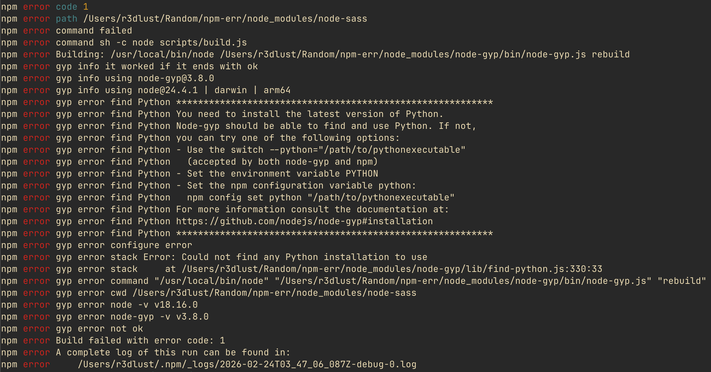
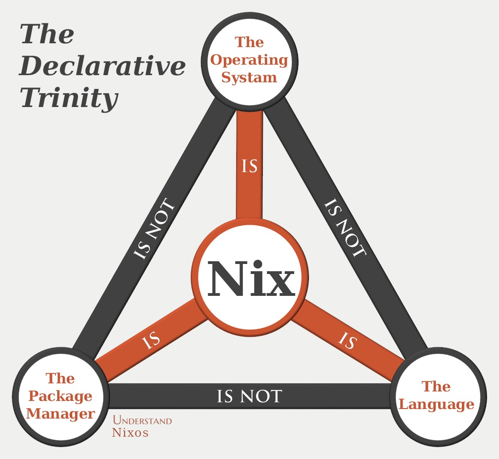
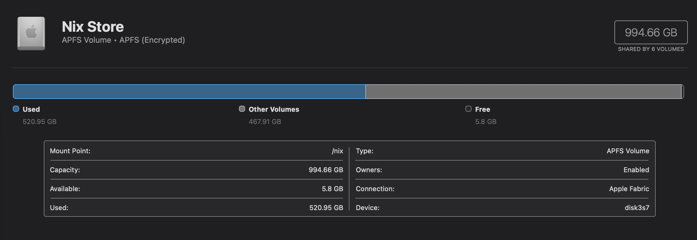
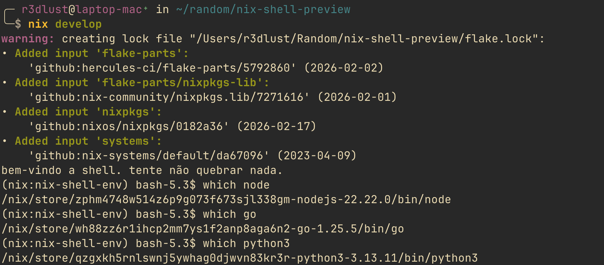

# escapando do inferno de dependências por engenharia excessiva da minha própria vida

olha, eu não sentei na cadeira com a intenção de construir um ambiente de desenvolvimento totalmente declarativo, reprodutível e portátil que abrange 457 commits e 7 meses da minha vida. eu só queria escrever código sem ter que passar as três primeiras horas do meu dia brigando com a versão do python do meu sistema.

todo mundo já passou por isso. você clona um repositório, roda `npm install` ou `pip install`, e de repente o seu sistema operacional começa a reclamar que você tem a versão errada do openssl instalada em `/usr/lib`. o que você faz então? você apela pro docker.



você sobe um kernel linux inteiro virtualizado, carrega uma imagem de 2gb pra cima e pra baixo, e finge que embarcar um sistema operacional inteiro só pra rodar um servidor node.js é uma "boa prática". é um lixo. o docker é um band-aid em cima de um sistema fundamentalmente quebrado. é como comprar uma casa nova toda vez que a pia entope.

foi por isso que eu acabei pesquisando sobre o nix. eu tava irritado, com preguiça, e eu odeio virtualização quando ela não é necessária. por que eu preciso simular um disco rígido e uma interface de rede só para garantir que um pacote javascript tenha os bindings nativos corretos? não fazia sentido para mim.

## o que diabos é nix? (não, é sério)

antes de entrarmos nos detalhes de como eu fiz uma engenharia excessiva na minha infraestrutura, vamos alinhar a terminologia. a convenção de nomes no ecossistema nix é indiscutivelmente a pior parte dele. quando as pessoas dizem "nix", elas podem estar falando de três coisas diferentes.



primeiro, existe o `nix` como gerenciador de pacotes. essa é a ferramenta real que você roda no seu terminal. é um software que pode ser instalado em praticamente qualquer distribuição linux ou macos (ou windows via wsl). ele gerencia pacotes, compila software e lida com dependências.

segundo, existe o nix a linguagem (frequentemente chamada de linguagem de expressões nix). é uma linguagem puramente funcional e de avaliação preguiçosa (lazy evaluation) projetada especificamente para declarar pacotes e configurações. parece um pouco com json e tem a sintaxe de uma equação matemática escrita por alguém que realmente ama chaves e pontos-e-vírgulas.

terceiro, existe o nixos. essa é uma distribuição linux inteira construída ao redor do gerenciador de pacotes nix. no nixos, tudo, desde o kernel até o arquivo `/etc/passwd` e o seu ambiente de desktop, é declarado usando a linguagem nix e gerenciado pelo gerenciador de pacotes nix.

eles são relacionados, mas não são a mesma coisa. você não precisa do nixos para usar o gerenciador de pacotes nix. você pode usar o nix no seu macbook atual hoje mesmo.

## matando o fhs

então o que faz o nix ser tão especial? tudo se resume ao sistema de arquivos.

a maioria dos sistemas baseados em unix segue o padrão de hierarquia do sistema de arquivos (fhs). isso significa que os binários vão para `/usr/bin`, as bibliotecas vão para `/usr/lib`, e a configuração vai para `/etc`. esse é um estado global e mutável. se o aplicativo a precisa da `libfoo.so` versão 1, e o aplicativo b precisa da `libfoo.so` versão 2, você tem um problema. ambos querem morar em `/usr/lib`. essa é a causa raiz do inferno das dependências. você acaba criando symlinks aleatórios, editando `$LD_LIBRARY_PATH` no seu `.bashrc` como um animal, e rezando pra isso não quebrar alguma outra coisa.

o nix diz "dane-se o fhs". em vez disso, ele tem a nix store, geralmente localizada em `/nix/store`. cada pacote, cada biblioteca, cada arquivo de configuração é compilado e armazenado em um diretório nomeado com um hash criptográfico de todas as suas entradas (código-fonte, scripts de build, dependências).

### a beleza do hash criptográfico

a beleza disso é o reuso. se você tem dois projetos completamente diferentes que requerem exatamente a mesma versão do `bash` ou da `glibc`, o nix não faz o download ou compila as coisas duas vezes. como o hash das entradas é idêntico, ambos os projetos simplesmente apontam para a exata mesma derivation na `/nix/store`. você tem o isolamento do docker sem a duplicação massiva de bibliotecas compartilhadas.

se você mudar um único bit de uma dependência, o hash muda, e o pacote é compilado em um diretório completamente novo. isso significa que você pode ter cinquenta versões diferentes do python instaladas simultaneamente, e elas nunca vão entrar em conflito. nada nunca é sobrescrito. sua `/usr/lib` continua intocada.

### ambientes puros e a sandbox

isso nos leva ao conceito de ambientes de desenvolvimento "puros". quando você entra em um nix shell, o nix manipula o seu `$PATH` e outras variáveis de ambiente para apontar exclusivamente para os pacotes na nix store que você solicitou explicitamente. ele isola (sandbox) o seu ambiente. se você não declarou o `curl` como uma dependência, seu script de build não vai conseguir achá-lo, mesmo que ele esteja instalado globalmente no seu sistema. isso garante reprodutibilidade. se compila na minha máquina, vai compilar na sua máquina, ponto final.

## o erro de 500gb do rust

mas tem uma pegadinha nesse nirvana imutável. como o nix nunca sobrescreve nada e compila tudo isoladamente, a sua `/nix/store` cresce. e cresce rápido.

o nix lida com isso através do garbage collection (coleta de lixo). funciona de forma semelhante ao gerenciamento de memória em linguagens de programação. se um pacote na store não for referenciado por nenhum ambiente ativo ou "gc root", ele pode ser deletado com segurança.

uma coisa engraçada aconteceu comigo um tempo atrás. eu estava no meu laptop macos, cuidando da minha vida em uma quarta-feira qualquer, e notei que meu espaço em disco estava perigosamente baixo. eu rodei um analisador de disco e descobri que a minha `/nix/store` estava usando mais de 500gb!



lembra que eu disse que o nix reusa derivations idênticas? bom, acontece que se você estiver escrevendo muitas ferramentas customizadas usando a toolchain nightly do rust com targets customizados, você está essencialmente gerando um hash novo todo santo dia. o compilador nightly é um alvo que se move muito rápido. toda vez que eu criava um dev shell para um projeto rust, o nix avaliava as novas entradas, baixava e compilava o compilador nightly mais novo, e criava uma derivation massiva e única na store.

durante meses sem rodar o garbage collector, eu armazenei cada iteração do compilador do rust conhecida pelo homem.


um rápido `nix-collect-garbage -d` depois, e eu tinha meu laptop de volta. é uma funcionalidade, não um bug, mas definitivamente requer que você seja babá dela. você simplesmente não pode deixar a sua máquina rodando por meses sem limpar a store se você usa dependências que atualizam muito rápido.

## escapando do docker

vamos olhar para um exemplo prático de por que o nix nativamente é melhor que a virtualização do docker. na minha universidade, eu precisava rodar o ros2 (robot operating system). historicamente, rodar ros2 significava que você tinha que usar o ubuntu. se você estivesse em um mac, você tava ferrado.

### o pesadelo de rede do ros2

a maioria das pessoas tenta resolver isso com o docker. mas ros2 dentro de um docker é um pesadelo absoluto, especificamente por causa de rede.

o ros2 depende pesadamente de dds (data distribution service) para o discovery (descoberta) de nós. ele quer estar nativamente na rede do host para mandar pacotes de broadcast e encontrar outros robôs ou nós. quando você enfia o ros2 dentro de uma rede de ponte virtualizada do docker, o discovery de dispositivos quebra instantaneamente.

você acaba tendo que escrever uma enxurrada de variáveis de ambiente e perfis xml customizados para remendar a implementação do dds apenas para ele conseguir ver dispositivos na sua rede local. e mesmo assim, metade do tempo ele perde os pacotes ou simplesmente se recusa a reconhecer um nó que está sentado a um metro de você.

### execução nativa ao resgate

eu me recusei a mudar pro ubuntu e me recusei a lidar com o lixo de redes do docker. em vez disso, eu construí um ambiente ros2 reprodutível usando nix e pixi. você pode conferir aqui: [ros2-humble-env](https://github.com/GustavoWidman/ros2-humble-env).

quando um aluno clona aquele repositório e roda `nix develop`, o nix baixa todas as dependências exatas, configura o ambiente python, ajeita as flags do cmake, e joga eles num shell onde todos os comandos do ros2 simplesmente funcionam nativamente na máquina deles, até mesmo no macos.

sem vms, sem redes de ponte de docker bloqueando discovery do dds, sem contaminação do sistema. o shell hook até roda os comandos do pixi automaticamente no início para lidar com algumas bizarrices de pacotes python locais. foi um sucesso enorme, puramente porque eliminou o atrito de configuração inicial e a camada de virtualização de rede para todos na turma.

## começando (sem perder a cabeça)

se você quer testar isso, não comece reescrevendo todo o seu sistema operacional. comece com um simples shell de desenvolvimento.

pessoalmente, eu prefiro pesadamente usar `flake-parts`. muitos tutoriais antigos vão te apontar para `flake-utils`, mas `flake-parts` usando o módulo `perSystem` é muito mais limpo, reduz boilerplate e escala infinitamente melhor quando seu projeto cresce.

aqui está tudo que você precisa para iniciar um ambiente reprodutível hoje. coloque isso em um arquivo `flake.nix` na raiz do seu projeto:

```nix title="flake.nix"
{
  description = "um ambiente de dev pra teste de sanidade";

  inputs = {
    nixpkgs.url = "github:nixos/nixpkgs/nixos-unstable";
    flake-parts.url = "github:hercules-ci/flake-parts";
    systems.url = "github:nix-systems/default";
  };

  outputs = inputs@{ flake-parts, systems, ... }:
    flake-parts.lib.mkFlake { inherit inputs; } {
      systems = import systems;

      perSystem = { pkgs, ... }: {
        devShells.default = pkgs.mkShell {
          packages = with pkgs; [
            nodejs_22
            python3
            go
          ];

          shellHook = ''
            echo "bem-vindo a shell. tente não quebrar nada."
          '';
        };
      };
    };
}
```

rode `nix develop` naquele diretório. o nix vai avaliar o flake, baixar exatamente o nodejs 22, python 3 e go, e te jogar em um shell onde esses binários existem. quando você sai do shell, eles somem do seu `$PATH`. o sistema host continua completamente alheio ao que aconteceu.



### bônus: mantendo o seu shell precioso

por padrão, o `nix develop` te joga em um no shell bash mais feio que você ja viu na sua vida. se você é como eu e passou milênios ajustando a sua configuração do `zsh` ou do `nushell`, isso é levemente enfurecedor.

você _pode_ usar uma gambiarra suja para forçar o nix a usar o seu shell:

```bash
nix develop -c env $'SHELL=[SEU_SHELL]' [SEU_SHELL]
```

mas fica o aviso: isso tem problemas. o seu ambiente não fica mais totalmente "selado" porque ele herda lixo da configuração global do seu usuário, o que meio que anula o propósito de uma 'sandbox' pura.

a maneira real e civilizada de fazer isso é com o [direnv](https://direnv.net/). você instala o `direnv` e o [nix-direnv](https://github.com/nix-community/nix-direnv) (para fazer cache das avaliações e acelerar as coisas drasticamente), joga um arquivo `.envrc` no seu projeto com as palavras `use flake`, e roda `direnv allow`.

agora, toda vez que você der um `cd` no diretório do seu projeto, o seu shell familiar e altamente customizado absorve automaticamente as variáveis de ambiente do nix em segundo plano. sem subshells, sem fallback pro bash, apenas pura mágica.

se você quiser ver como eu realmente configuro isso em todas as minhas máquinas sem perder a cabeça, pode dar uma olhada na minha configuração global do direnv [bem aqui](https://github.com/GustavoWidman/nix/blob/main/modules/common/direnv.nix). ela basicamente faz o direnv calar a boca um pouco, ativa o `nix-direnv` e integra direto com meu shell (você talvez tenha que checar meus arquivos do nushell também pra achar o hook do direnv). sinta-se à vontade para roubar.

## as partes ruins (e há muitas)

você pode estar pensando: "nossa, o nix é perfeito". segura a emoção. o nix é brilhante, mas também é um pé no saco colossal.

primeiro de tudo, a curva de aprendizado não é uma curva; é um penhasco coberto de óleo. tudo que você acha que sabe sobre shell scripting é jogado pela janela porque o sandbox bloqueia acesso à rede por padrão durante a fase de build. você não pode simplesmente dar um `wget` num arquivo em um script de build. você tem que fornecer um hash criptográfico do arquivo de antemão pro nix saber exatamente o que ele está baixando.

### compilando de olhos vendados

essa falta de conectividade de rede é uma dor de cabeça colossal para realmente compilar software. se você tentar rodar um `cargo build` ou `npm install` ingenuamente dentro de um build do nix, ele vai falhar instantaneamente porque não consegue acessar a internet para puxar as dependências.

para contornar essa restrição offline, você tem que usar "conectores" ou builders específicos para cada linguagem. para rust, você talvez use [crane](https://crane.dev/) ou `rustPlatform.buildRustPackage`. para bun, você usa [bun2nix](https://nix-community.github.io/bun2nix). essas ferramentas precisam analisar agressivamente o lockfile do seu projeto, descobrir cada dependência individual, e traduzi-las em derivations puras do nix.

o `bun2nix`, por exemplo, tem a peculiaridade irritante de precisar de um arquivo intermediário `bun.nix`. esse arquivo armazena os hashes criptográficos de cada pacote na sua árvore de dependências, agindo essencialmente como um lockfile gigante e feio gerado exclusivamente para o nix conseguir ler.

mas aqui está a reviravolta: essa algema super apertada é, na verdade, um superpoder absoluto para ambientes de produção. como o acesso à rede é fisicamente bloqueado durante o build, ataques à cadeia de suprimentos (supply chain attacks) que dependem da execução de código malicioso no momento da compilação (como baixar um script nocivo durante um hook de `npm postinstall`) são parados na hora. o build simplesmente falha. é uma camisa de força, mas torna os seus deployments matematicamente à prova de balas contra surpresinhas de runtime.

### lendo o ilegível

o ferramental padrão é um pouco tosco. quando uma avaliação falha profundamente aninhada dentro do `nixpkgs`, você recebe um stack trace de 50 linhas apontando pra um arquivo que você não escreveu, reclamando de um atributo que não existe em um set que foi gerado por uma função que você nunca chamou.

e a documentação... ah, a documentação. o módulo `lib`, que contém todas as funções da biblioteca padrão que você precisa para realmente escrever código nix, é um pesadelo de navegar. tentar descobrir o que `lib.attrsets.mapattrs` faz lendo a documentação oficial vai fazer você questionar as escolhas da sua carreira.

se você decidir entrar nessa empreitada masoquista, você precisa de ferramentas de sobrevivência. favorite o [noogle.dev](https://noogle.dev) agora mesmo. é um salva-vidas absoluto para pesquisar funções da biblioteca padrão. para procurar pacotes, use [search.nixos.org](https://search.nixos.org). e para pesquisar opções de configuração de flakes, [mynixos.com](https://mynixos.com) é o seu melhor amigo.

### voando às cegas

a falta de uma boa experiência de ide/lsp é uma decepção real. `nixd` e `nil` existem, mas eles ainda sofrem com avaliações complexas de flakes. você passa muito tempo voando às cegas. syntax highlighting funciona, mas go-to-definition é uma roleta russa. você basicamente tem que segurar o modelo inteiro de avaliação na sua cabeça, como se tratasse variáveis de código como conceitos abstratos de matemática (estilo $E=mc^2$) porque o lsp não vai te ajudar a descobrir o que uma variável resolve.

## valeu a pena?

apesar de todas as minhas reclamações, eu ainda uso o nix pra tudo. minha infraestrutura inteira, que roda múltiplos servidores, máquinas virtuais, e o meu macbook, está definida em [um único repositório](https://github.com/GustavoWidman/nix). eu tenho expressões nix customizadas, scripts shell em nushell, e bibliotecas auxiliares que orquestram minha vida digital inteira em 6 hosts diferentes. são 456 commits de pura loucura, mas funciona perfeitamente.

o nix é frustrante, excessivamente complexo e às vezes enfurecedor. mas quando funciona, parece mágica. ele quase elimina completamente o problema do "na minha máquina funciona" garantindo que a máquina de todo mundo seja exatamente igual no nível de ambiente. eu digo _quase_ porque se um pacote está fundamentalmente quebrado em macs aarch64, ou simplesmente não foi empacotado para a sua arquitetura específica, o nix não pode te salvar. nesses casos, a virtualização realmente importa, porque a sua máquina genuinamente não tem a capacidade de rodar aquele software nativamente.

mas para os outros 99% do tempo? se você está cansado do inferno das dependências, imagens docker inchadas e estado global mutável, o nix talvez valha a pena a dor.
