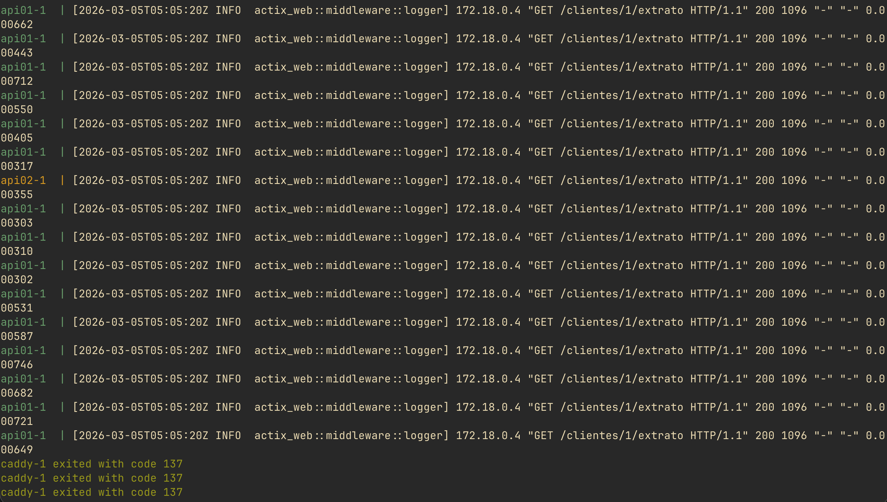
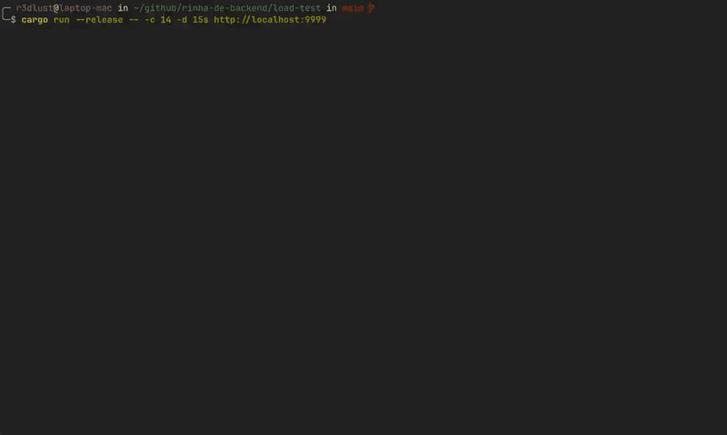
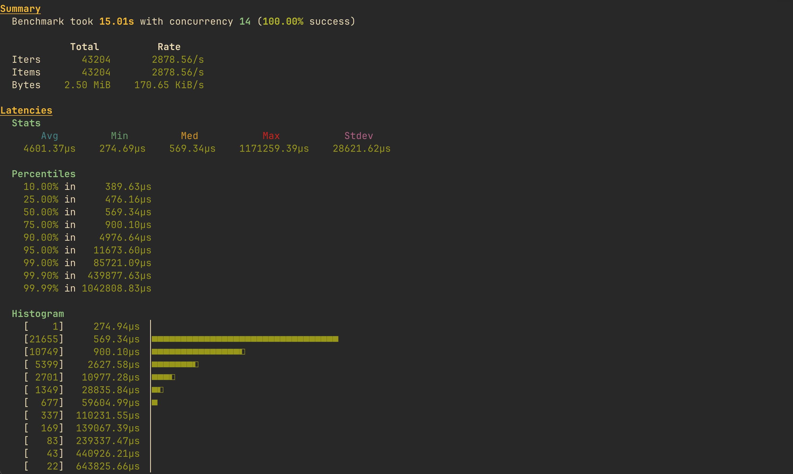

# squeezing 3000 requests per second from a shared sqlite file

this repo is a tad old now—it started as a homework assignment back when my teacher asked us to pass the "rinha de backend 2024 q1" challenge. the rules were simple: build a backend that manages financial transactions with specific cpu and memory constraints. the baseline goal was 340 sustained requests per second.

as always, i asked if i could do it in rust. what followed was a barrage of failed tests, weird edge cases, and a descent into tuning madness. here is the story of how i reached almost 10x the target with ~2900 rps at 0.5ms p50 latency.

## the first death: caddy runs out of memory

the initial architecture was textbook: a load balancer sitting in front of two rust api instances (using actix-web), backed by a postgres database. since i am a die-hard fan of caddy, it was my first choice for the reverse proxy.

### tuning into the void

under load, caddy started throwing oom (out of memory) errors and crashing the entire stack. i spent hours tweaking worker pools and buffer sizes. i gave it as much ram as the strict challenge limits would allow, but it was never enough. the memory footprint just kept climbing under sustained concurrent connections.

### accepting the nginx pill

eventually, i had to face reality. caddy is great for ergonomics, but when every megabyte of ram counts, there is no denying that nginx is much more optimized for raw throughput. i swapped caddy for a hyper-tuned alpine nginx image, cranking up `worker_rlimit_nofile 65535` and maxing out the `keepalive_requests`. the oom crashes stopped immediately.



docker compose logs showing caddy eating all the ram and dying.

## the database dilemma: starving for resources

with the load balancer fixed, the bottleneck moved down the stack. the api instances were fighting for cpu cycles with postgres.

### greedy postgres

i spent a full day on postgres fine-tuning. i messed with connection keep-alives, built better connection pooling in the rust api, and threw in special postgres flags for minimal resource usage with maximum throughput. i re-adjusted the resource distribution across the docker containers, allocating almost everything to the database just to keep it happy.

### the "what if i just" moment

staring at `docker compose stats`, i realized the fundamental flaw: the fourth container (postgres) was eating resources that could be spent on serving requests. i thought, "i don't really _need_ postgres, do i?"

that led me to drop the database entirely and use an embedded sqlite file mounted as a shared volume across both api containers.

## abusing sqlite with wal mode

the idea was to run two concurrent api instances, both reading and writing to the exact same `/shared/rinha.db` file at the same time.

### mounting a shared volume

i set up a shared volume in `docker-compose.yml` and pointed the `DATABASE_URL` to it. suddenly, the resources previously hogged by postgres were free to be claimed by the load balancer and the rust workers.

### the pragmas that made it work

technically, sqlite in wal mode allows concurrent readers and one writer at a time, not concurrent writers. the `busy_timeout(5000)` you set is exactly what makes this work—it tells the rust threads to wait gracefully if the file is locked by the other writer, rather than throwing a `database is locked` error immediately.

```rust title="main.rs"
let pool = sqlx::sqlite::SqlitePoolOptions::new()
    .max_connections(14)
    .connect_with(
        sqlx::sqlite::SqliteConnectOptions::new()
            .filename(db_path)
            .journal_mode(sqlx::sqlite::SqliteJournalMode::Wal)
            .synchronous(sqlx::sqlite::SqliteSynchronous::Normal)
            .busy_timeout(std::time::Duration::from_millis(5000))
            .pragma("temp_store", "memory")
            .pragma("mmap_size", "268435456"), // 256mb memory-mapped i/o
    )
    .await?;
```


## breaking the benchmark tool

at this point, the api was so fast that the testing infrastructure started to break down.

### gatling chokes on open files

the official rinha challenge used gatling to dispatch requests. however, my api was handling much more load than gatling could spit out. the benchmarker choked and threw `too many open files` errors, rendering the official test useless for finding the actual upper limit of the system.

### writing a custom load tester in rust

to prove the true speed of the api, i practically built my own custom load tester from scratch. using the `rlt` crate and `reqwest`, i orchestrated a load profile that perfectly matched the gatling script.

```rust title="main.rs"
let (status, bytes, duration) = match self.counter % 34 {
    n if n % 2 == 0 && n != 22 && n != 33 => {
        tests::testar_debito(&self.url, client).await?
    }
    33 => tests::testar_extrato(&self.url, client).await?,
    _ => tests::testar_debito(&self.url, client).await?,
};
```

with the new tester, i finally clocked the system at ~2900 rps.


a terminal recording showing the custom rust load tester aggressively dispatching requests without dropping connections.



the final output table from the load tester, clearly showing ~2900 requests per second with a 0.5ms p50 latency.

## the production tradeoffs

while this setup technically didn't violate any rules of the challenge, it is completely useless for a real-world distributed system.

because sqlite requires a local file, both api instances must live on the exact same physical machine. you cannot scale this horizontally across different physical nodes. it is a localized, single-node hack that trades network resilience for raw speed.

## the final verdict

sometimes the fastest architecture is the dumbest one. cutting out the network hop and letting two rust binaries fight over a memory-mapped file is significantly faster than tuning a proper relational database.

it's worth noting this code is about 9 months old now. today, with much more experience in hpc, cpu profiling, and rust in general, i would likely build this entirely differently and squeeze out even more performance.

just don't deploy this to production unless you are okay with your entire database living in a single docker volume. if you want to see the full code, you can check out the [rinha-de-backend repository](https://github.com/GustavoWidman/rinha-de-backend).
