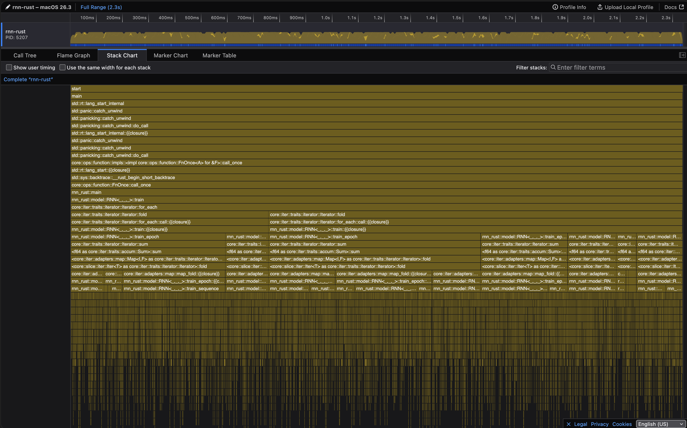
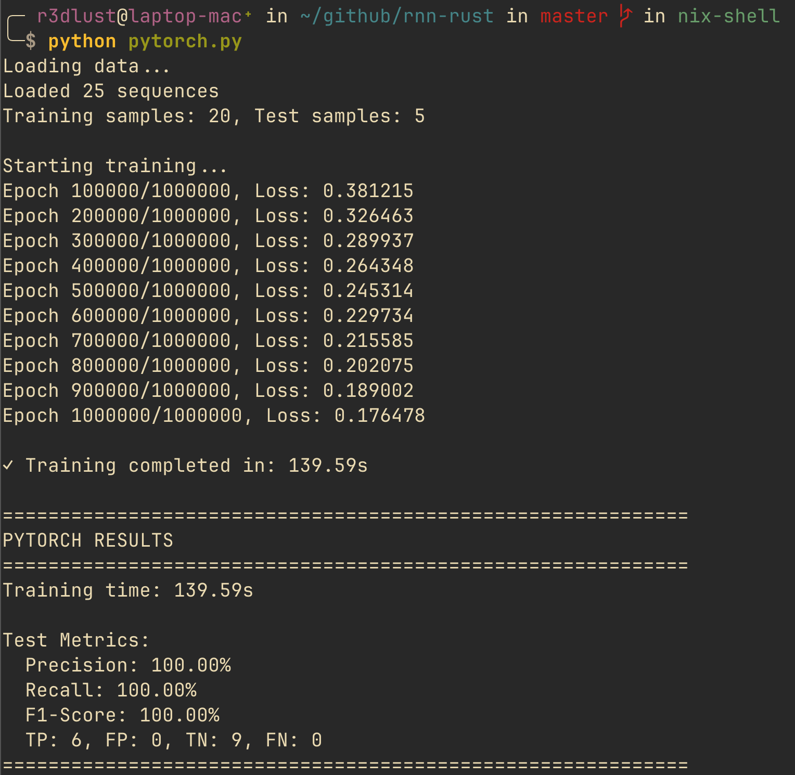
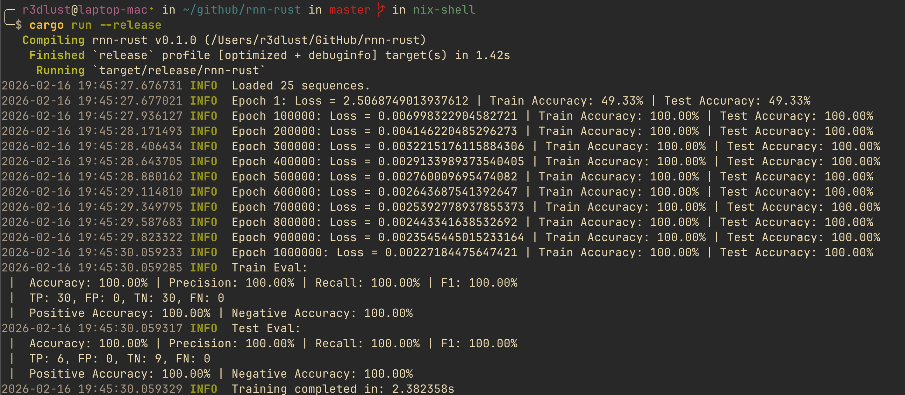
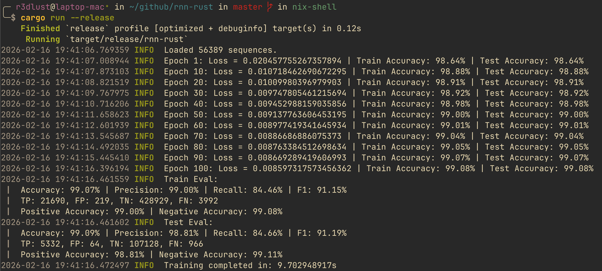
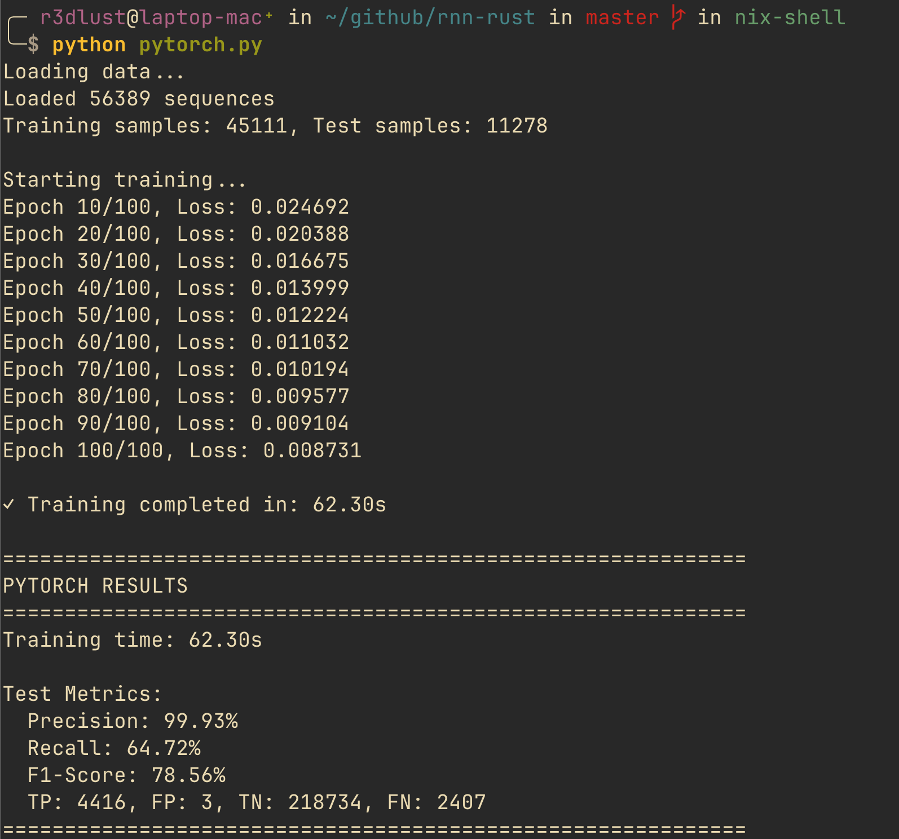

# como acidentalmente otimizei uma rnn em rust para ser mais rápida que o pytorch

eu odeio mágica.

estou atualmente no meu último ano de faculdade. no ano passado, em uma das nossas aulas de matemática, abordamos redes neurais. a maioria das pessoas só teve que fazer o dever de casa padrão, como aquela vez que tivemos que implementar um loop feedforward simples no excel só pra ver os números mudarem. foi engraçado, mas não foi o suficiente para mim.

mais tarde, quando o currículo avançou para séries temporais e redes neurais recorrentes (RNNs), eu vi uma oportunidade. as aulas de feedforward e backpropagation estavam agendadas com semanas de intervalo. naturalmente, sendo o engenheiro impaciente que sou, decidi implementar a coisa toda em rust enquanto esperava.

isso não era um requisito da aula. eu só queria entender a matemática antes mesmo do professor escrever no quadro.

o objetivo? zero dependências. nada de `ndarray`, nada de `candle`, nada de `torch`. só eu, um `vec`, e um monte de constantes genéricas.

eu chamei de `rnn-rust`. criativo, eu sei.

## a jornada (e a arrogância)

construir isso me ensinou mais do que as aulas. quando a aula de backpropagation finalmente chegou, eu já sabia exatamente o que o professor ia dizer. acabei tendo algumas conversas de alto nível com ele depois da aula sobre gradientes e regras da cadeia, simplesmente porque eu tinha passado as últimas duas semanas debugando isso.

### a abordagem ingênua (ou: como torrar cpu)

minha primeira tentativa foi... fofa. funcionou. aprendeu. ver a curva de perda cair em uma rede feita à mão é uma dose de dopamina que nenhuma api de alto nível consegue replicar.

mas aí um amigo me desafiou.

"roda um milhão de épocas nesse dataset de fraude de cartão de crédito. é rust, então vai ser instantâneo, né?"

não foi instantâneo. demorou 60 segundos.

sessenta. segundos.

para um dataset minúsculo (3 inputs, 1 output, 75 entradas). eu me senti fisicamente mal. rust deveria ser _incrivelmente rápido_, e lá estava eu, perdendo para uma lesma fazendo divisão longa.

infelizmente, eu não tenho screenshots daquelas primeiras execuções vergonhosas. eu ainda não tinha inicializado um repositório git, então aquele código ingênuo e cheio de alocações foi perdido ao tempo, existindo apenas nos meus pesadelos.

mas eu lembro o que o `samply` (meu profiler de escolha) me disse. era um massacre de alocações de memória.

inicialmente, minha matemática de matrizes parecia com isso:

```rust title="matrix.rs"
// implementação ingênua (pseudocódigo)
fn dot_vec(&self, vec: &Vector) -> Vector {
    let mut result = Vector::new(); // alocação!
    // ... matemágica ;) ...
    result // move!
}
```

cada operação única—produtos escalares, multiplicações de matrizes, adições—estava alocando um novo vetor, fazendo a conta, e retornando-o. num loop de treinamento rodando milhões de vezes, isso é morte por mil `malloc`s.



## o arco da otimização

### o momento "pera, eu posso só..."

a primeira correção foi óbvia: parar de copiar tudo.

eu reescrevi os módulos de álgebra linear para usar mutações in-place. em vez de retornar um novo vetor, eu passava uma referência mutável para um buffer.

```rust title="matrix.rs"
pub fn dot_vec_into(&self, vector: &Vector<COLS, f64>, out: &mut Vector<ROWS, f64>) {
    self.iter()
        .zip(out.iter_mut())
        .for_each(|(row, out_elem)| *out_elem = row.mul_sum(vector));
}
```

isso ajudou, mas o profiler ainda mostrava muito tempo gasto em... iteradores?

### pesadelo de iteradores

iteradores em rust são lindos. `vec.iter().map(...).fold(...).collect()` é legível e expressivo. é o êxtase da programação funcional.

mas quando você encadeia eles muito profundamente num loop crítico, às vezes o compilador não otimiza todo o overhead, especialmente se houver verificações de limites implícitas ou moves acontecendo.

eu descobri que `fold` e `reduce` estavam constantemente movendo valores acumulados. cada tick da chamada `.fold` passa o objeto dobrado para a próxima iteração, e esse custo de movimento soma quando você faz isso milhões de vezes. o profiler era apenas um mar de instruções `move` moendo a função de backpropagation para uma velocidade de criança pequena.

a correção? arrancar as cadeias funcionais bonitas e substituí-las por loops `for_each` simples usando uma referência do escopo externo. parecia arcaico, mas deu um ganho de velocidade massivo.

### o padrão workspace

mesmo com operações in-place, eu ainda estava criando vetores temporários dentro da função de backpropagation para segurar gradientes e valores intermediários.

entra o `Workspace`.

```rust title="workspace.rs"
pub struct Workspace<const INPUT: usize, const HIDDEN: usize, const OUTPUT: usize> {
    pub input_contrib: Vector<HIDDEN, f64>,
    pub hidden_contrib: Vector<HIDDEN, f64>,
    pub new_hidden: Vector<HIDDEN, f64>,
    pub output: Vector<OUTPUT, f64>,
    pub dl_dh: Vector<HIDDEN, f64>,
    // ... mais buffers
}
```

em vez de alocar isso na stack ou heap a cada passo, eu aloco _uma vez_ quando o treinamento começa. eu passo essa struct `Workspace` para `feedforward` e `backpropagate` como uma referência mutável. é essencialmente uma arena de memória manual para minha arquitetura específica de rede.

só precisamos zerar o workspace para ter uma folha em branco para a próxima execução. isso melhorou a localidade de cache significativamente. a cpu apenas continua batendo nos mesmos endereços de memória quentes repetidamente.

## a hora da verdade

### os resultados

depois dessas mudanças, aquele treino de 60 segundos caiu para **2.4 segundos**.

isso coçou uma parte do meu cérebro que eu não sabia que existia. comecei a me perguntar... "e se isso for realmente mais rápido que o pytorch?"

pytorch é o padrão ouro. tem décadas de otimização, backends blas, instruções simd, e times de gênios trabalhando nele. eu sou um cara com um laptop e uma recusa em usar `cargo add`.

eu escrevi um script pytorch equivalente: mesma arquitetura, mesmo dataset, mesmos hiperparâmetros. 3 neurônios de entrada, cinco ocultos, um de saída. ativação relu, perda mse, otimizador sgd com taxa de aprendizado de `0.000001`.

pytorch demorou **140 segundos** em média.



eu rodei de novo. 139 segundos.

meu código rust levou 2.4 segundos.



meu código em rust foi quase **60x mais rápido**.

### comparando maçãs com... cobras python gigantes?

ok, vamos ser reais. pytorch não é lento. python é lento.

para datasets minúsculos e redes pequenas, o overhead do interpretador python e do dispatcher do pytorch domina o tempo de execução. o pytorch passa mais tempo perguntando "o que você quer que eu faça?" do que realmente fazendo a conta.

minha implementação em rust, com seus const generics e checagens de tamanho em tempo de compilação, sabe exatamente o que precisa fazer. o compilador desenrola loops, faz inlining de funções, e há zero overhead de runtime para despachar operações.

mas o que acontece quando escalamos?

### o confronto kaggle

decidi testar contra um dataset real: o famoso dataset de fraude de cartão de crédito do kaggle. ele tem 56.389 sequências.

eu configurei o teste novamente, 29 inputs, 10 neurônios ocultos, 1 output, 100 épocas, perda mse, sgd (lr=0.001), ativação tanh e um avaliador de classificação binária com limiar de 0.5.

eu rodei o código em rust. tempo médio de treinamento: **9-11 segundos**.



então eu rodei o pytorch.

tempo médio de treinamento: **60-65 segundos**.



o rust ainda ganha, mas o abismo de 60x encolheu para uns 6x. consegui sentir o meu fim iminente respirando no meu cangote, sussurrando que eu ainda não sou páreo para os gigantes. conforme o dataset cresce, os backends otimizados do pytorch vão começar a brilhar, enquanto minha implementação ingênua vai suar a camisa pra acompanhar.

## conclusão

eventualmente, se você fizer as matrizes grandes o suficiente, o backend blas do pytorch (geralmente mkl ou openblas) vai esmagar meus loops `for` ingênuos. daria pra otimizar mais (e nivelar o jogo) se eu me rendesse a bibliotecas de álgebra linear que usam otimizações pesadas de blas e simd, tipo o `ndarray`. vetorização simd é poderosa, e eu ainda não implementei isso.

mas este projeto me mostrou que rolar suas próprias ferramentas nem sempre é perda de tempo. às vezes, para problemas muito específicos e de pequena escala, uma implementação sob medida que corta o overhead genérico pode absolutamente destruir os gigantes da indústria.

além disso, não tem nada como o `cargo run` terminar antes do seu dedo levantar do enter.

confira o código aqui: [rnn-rust](https://github.com/GustavoWidman/rnn-rust)
