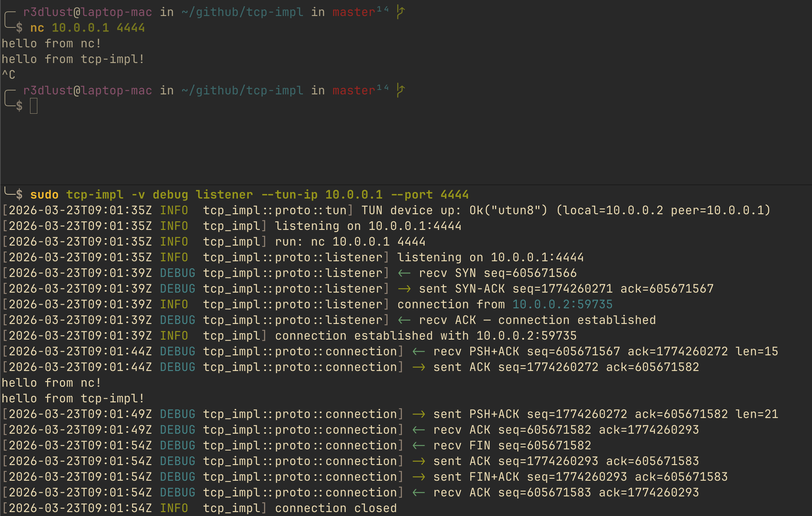

# writing tcp without the kernel's help

i was waiting on a job interview answer and had a free weekend. the dangerous combination.

i'd already built UDP from scratch last year: raw sockets, manual headers, the works. that one was a college assignment that spiraled. this one was purely self-inflicted.

TCP is harder. not impossibly harder, but hard in ways that surprise you. the protocol is 43 years old and it still has corners that will quietly ruin your afternoon if you're not paying attention.

here's what i built, what broke, and what i'd do again.

## why tun instead of raw sockets

the UDP project used raw sockets. at the time that felt like the right call. you own the socket, write the headers, done.

but raw sockets have a dirty secret: the kernel still processes the traffic. it sees your SYN arrive, checks if there's a socket listening on that port, and if not, sends a RST. your beautiful handcrafted segment never even gets a chance to breathe.

for UDP that's manageable. for TCP it's fatal. the kernel will RST every SYN before your userspace code can process it.

### what a TUN device actually does

a TUN device is a virtual network interface. when you route traffic through it, the kernel doesn't process it as a real connection. instead, it delivers the raw IP packets directly to the file descriptor you have open.

```
traffic for 10.0.0.1 → kernel routing table → /dev/net/tun → your fd → you
```

no RSTs. no kernel TCP stack intercepting anything. just bytes arriving in a buffer.

that's the whole trick.

### the companion ip problem

here's where it gets subtle. if you assign your TUN interface's local address to the IP you want to own, the kernel still owns that IP. it will still answer for it.

the fix is a point-to-point setup:

```rust title="tun.rs"
fn companion_ip(ip: Ipv4Addr) -> Ipv4Addr {
    let [a, b, c, d] = ip.octets();
    let d2 = if d < 255 { d + 1 } else { d - 1 };
    Ipv4Addr::new(a, b, c, d2)
}
```

you pass `--tun-ip 10.0.0.1`. that becomes the **peer** address. the kernel routes traffic there through the TUN fd instead of answering it. the interface's actual local address is `10.0.0.2` (or `10.0.0.0` if you're at `.255`). the kernel owns `.2`, not `.1`.

```rust title="tun.rs"
config
    .address(local)      // 10.0.0.2 — kernel-owned
    .destination(peer)   // 10.0.0.1 — delivered to your fd
    .mtu(1500)
    .up();
```

it took me an hour to figure this out the first time with UDP. i implemented it correctly from day one here. small win.

## the state machine

RFC 793 defines TCP as a state machine. i implemented it as a pure function:

```rust title="connection.rs"
pub fn handle(&mut self, seg: &TcpHeader, payload: &[u8]) -> Vec<TcpAction> {
    if seg.rst {
        self.state = TcpState::Closed;
        return vec![TcpAction::Close];
    }

    match self.state {
        TcpState::Listen if seg.syn && !seg.ack => {
            // SYN received → send SYN-ACK, move to SynReceived
            let isn = Self::derive_isn(local_port);
            self.recv_seq = seg.seq_num.wrapping_add(1);
            let hdr = TcpHeader::syn_ack(local_port, remote_port, isn, self.recv_seq);
            vec![TcpAction::Send(hdr, vec![])]
        }
        TcpState::Established if seg.fin => {
            // remote closing → ACK their FIN, move to CloseWait
            self.recv_seq = seg.seq_num.wrapping_add(1);
            self.state = TcpState::CloseWait;
            let ack_hdr = TcpHeader::ack(/* ... */);
            vec![TcpAction::Send(ack_hdr, vec![])]
        }
        // ... and so on for every state transition
        _ => vec![],
    }
}
```

`handle()` takes a segment, returns a list of actions (`Send`, `Deliver`, `Close`, `Reset`), and mutates the connection state. nothing else. the caller decides what to do with the actions.

### states i skipped on purpose

this is happy-path TCP. no retransmits, no window scaling, no congestion control, no `TIME_WAIT` timer (i skip straight from `FinWait2` to `Closed`). if a segment is lost, you're just stuck.

that's fine. the goal was to understand the state machine, not to replace the kernel.

what i did implement fully: simultaneous close. when both sides send FIN at the same time, you hit `FinWait1 + FIN` instead of `FinWait1 + ACK`. the `Closing` state exists and works. i was mildly proud of this.

### the initial sequence number

ISN is derived from time XOR'd with the local port:

```rust title="connection.rs"
fn derive_isn(local_port: u16) -> u32 {
    let secs = SystemTime::now()
        .duration_since(UNIX_EPOCH)
        .map(|d| d.as_secs())
        .unwrap_or(0);
    (secs as u32) ^ (local_port as u32)
}
```

RFC 793 suggests a clock-driven ISN for security. this is clock-driven in the loosest possible sense. it's fine for a toy implementation.

## checksums from scratch

TCP requires an RFC 1071 one's-complement checksum over a 12-byte pseudo-header plus the TCP segment. the pseudo-header exists because IP addresses aren't in the TCP header and you still want to catch routing mistakes.

```rust title="packet.rs"
pub fn checksum(&self, src: &Ipv4Addr, dst: &Ipv4Addr) -> Result<u16> {
    let tcp_header_bytes = {
        let mut h = self.header.clone();
        h.checksum = 0;  // zero out before computing
        h.to_bytes()?
    };
    let tcp_length = (tcp_header_bytes.len() + self.payload.len()) as u16;
    let pseudo = TcpPseudoHeader::new(src, dst, tcp_length);  // src IP, dst IP, 0x00, proto=6, length

    let mut buf = Vec::with_capacity(/* total */);
    buf.extend_from_slice(&pseudo.to_bytes()?);
    buf.extend_from_slice(&tcp_header_bytes);
    buf.extend_from_slice(&self.payload);

    Ok(rfc1071_checksum(&buf))
}
```

verification is simple: running the same checksum over pseudo-header + the received segment should give you `0x0000`. i wrote a test for this that caught two subtle serialization bugs before i ever ran the code against a real network.


tests were the right call here. i wrote them from the start, for every header serializer and packet constructor. when i later ported to Linux, the tests told me immediately which platform-specific bits were broken without me having to manually watch bytes go across the wire.

## three bugs that made the happy path unhappy

the basic happy path (connect, exchange a few lines, disconnect) worked reasonably quickly. then i started testing edge cases.

### data stuck until the other side speaks first

the main loop looked like this initially:

```rust title="connection.rs"
loop {
    let pkt = tun.read_ip_packet()?;  // blocks until data arrives

    // drain outgoing queue and process pkt
}
```

the stdin reader thread queued outgoing segments via an mpsc channel. but the main thread was blocked on the TUN read. if you typed something, it sat in the queue until the remote side sent something (like an ACK for a previous message) to unblock the read.

the fix was obvious once i saw it: use a 50ms timeout instead of a blocking read.

```rust title="connection.rs"
loop {
    // drain outgoing queue first
    while let Ok((hdr, payload)) = out_rx.try_recv() {
        // ... send it
    }

    // non-blocking read with timeout
    let pkt = tun.read_ip_packet_timeout(Duration::from_millis(50))?;
    // ...
}
```

now the loop wakes up every 50ms minimum, drains whatever's queued, and processes any incoming packet. both directions flow freely.

### ctrl+c crashes instead of dying gracefully

`libc::poll()` is what i use for the timeout read. when you hit ctrl+c, the OS delivers `SIGINT` to the process, which interrupts `poll()` with `EINTR` (errno 4). i was propagating that as an error:

```
Error: Os { code: 4, kind: Interrupted, message: "Interrupted system call" }
```

the fix was a one-liner:

```rust title="tun.rs"
let ret = unsafe { libc::poll(&mut pfd, 1, timeout_ms) };
if ret < 0 {
    let err = std::io::Error::last_os_error();
    if err.kind() == std::io::ErrorKind::Interrupted {
        return Ok(None);  // treat as timeout, not error
    }
    return Err(err);
}
```

`ctrlc` crate sets an `AtomicBool`. the main loop checks it each iteration, calls `conn.close()` (sends FIN), and waits for the four-way teardown before exiting. clean shutdown.

### the passive close that never completes

when the remote closes first (say, you ctrl+c on `nc`), we receive a FIN, ACK it, and move to `CloseWait`. then nothing happens. we're stuck waiting for our own FIN.

RFC 793 says the application should call close() when it's done reading. my implementation had no automatic trigger for this. it just sat in `CloseWait` indefinitely.

the fix: detect the `CloseWait` transition and immediately call `close()`.

```rust title="connection.rs"
// After processing actions from handle()...
if conn.state == TcpState::CloseWait {
    if let Some(TcpAction::Send(hdr, payload)) = conn.close() {
        // send FIN, move to LastAck
    }
}
```

passive close works now. the four-way teardown runs to completion, state reaches `Closed`, and the listener re-accepts.


## cross-platform: macOS versus Linux

i wrote this on a mac. got it working. then realized i'd never tested it on Linux and my README was already making promises.

Linux turned out to be cleaner in most ways, except for one thing: `nc`.

### the 4-byte lie on macOS

macOS TUN devices (called `utun`) attach a 4-byte prefix to every frame:

```
[0x00, 0x00, 0x00, 0x02] + <IPv4 header> + <TCP segment>
```

that `0x02` is `AF_INET`. the kernel needs to know the address family even on a point-to-point link. you can't turn it off.

Linux TUN with `IFF_NO_PI` disabled gives you raw IP. no prefix at all.

the fix was compile-time gating:

```rust title="tun.rs"
#[cfg(target_os = "macos")]
const MACOS_AF_INET_PREFIX: [u8; 4] = [0x00, 0x00, 0x00, 0x02];

// read:
#[cfg(target_os = "macos")]
{
    let mut buf = vec![0u8; 4 + self.mtu];
    let n = self.inner.read(&mut buf)?;
    if buf[..4] != MACOS_AF_INET_PREFIX { return Ok(None); }
    Ipv4Packet::from_bytes(&buf[4..n])
}

#[cfg(target_os = "linux")]
{
    let mut buf = vec![0u8; self.mtu];
    let n = self.inner.read(&mut buf)?;
    Ipv4Packet::from_bytes(&buf[..n])
}
```

write works the same way in reverse. macOS prepends the prefix; Linux doesn't. the `compile_error!` macro covers anything that's neither.

### gnu nc vs bsd nc

this one cost me a while.

macOS ships with BSD netcat at `/usr/bin/nc`. by default it uses IPv4. everything works fine.

i also have GNU netcat 0.7.1 installed. `nc -l 4444` with GNU nc binds to `::` (IPv6 any), not `0.0.0.0`. so when my TUN device sends an IPv4 SYN to `10.0.0.3:4444`, the kernel RSTs it because there's no IPv4 listener.

GNU nc 0.7.1 also doesn't have a `-4` flag. the workaround is `-l -p 4444 -s 0.0.0.0`.

i spent longer than i should admit trying to figure out why sender mode "didn't work" before checking which `nc` i was running.

i can't believe i fell for it. i just implemented a 43-year-old transport protocol from scratch, got the three-way handshake right on the first real test, manually computed RFC 1071 checksums — and then got completely stumped by `which nc`. after all that, the hardest part of this project turned out to be testing.


## the tun crate upgrade incident

at some point i upgraded the `tun` crate from `0.6` to `0.8` along with `colored`.

the listener stopped connecting. the sender produced:

```
skipping non-IPv4 frame: IP version 0
```

turns out, `tun 0.8` changed the prefix handling behavior. it was now stripping the prefix on read and adding it on write internally, but only sometimes, and inconsistently with the version docs. my manual prefix handling was doubling up on write and stripping too much on read.

i spent about an hour trying to fix it before deciding it wasn't worth it. the `0.6` API works, is stable, and my code is explicit about what it does. i reverted and abandoned the bad commits via `jj`:

```bash
jj abandon <bad-commit-1> <bad-commit-2>
```

sometimes the right call is just: revert.

## it actually works




## was it worth it

yes. but with a caveat.

this implementation handles exactly one thing well: the happy path. no retransmits, no reordering, no window scaling, no respect for the remote's buffer size. real TCP stacks are a lot more complicated, and there's a reason for every bit of it.

but the goal wasn't to build a TCP stack. it was to understand one. and after this weekend i understand the state machine well enough to implement it again from memory, which is more than i can say for most things i've read about in textbooks.

the unit tests helped more than i expected. writing a test for every header serializer and packet constructor before running any real network traffic meant i spent the debugging sessions fixing logic, not typos. the first real handshake worked almost immediately.

the TUN approach versus raw sockets was the right lesson from the UDP project. i got to own the bytes end-to-end without fighting the kernel for ownership of the address. once you understand that the kernel's TCP stack only sees traffic addressed to IPs it owns, the routing trick becomes obvious.

this codebase is also just better than udp-impl. that one turns one year old this week, and it shows, no tests, raw sockets, code organization that made sense at the time. tcp-impl has TDD from day one, a proper module hierarchy, TUN-based architecture that doesn't fight the kernel. it's a better snapshot of where i am now as a Rust engineer than anything i wrote a year ago.

for the code: [github.com/GustavoWidman/tcp-impl](https://github.com/GustavoWidman/tcp-impl)
