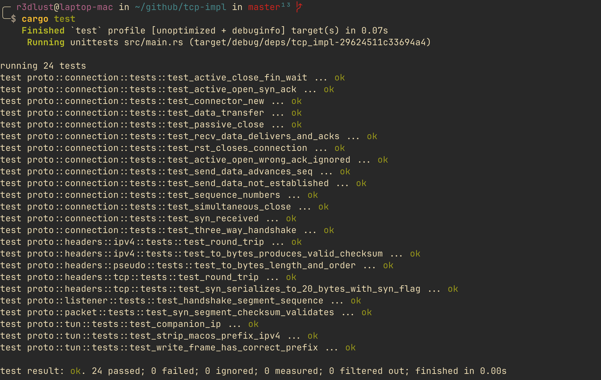
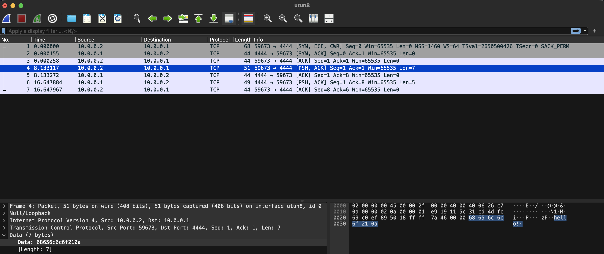
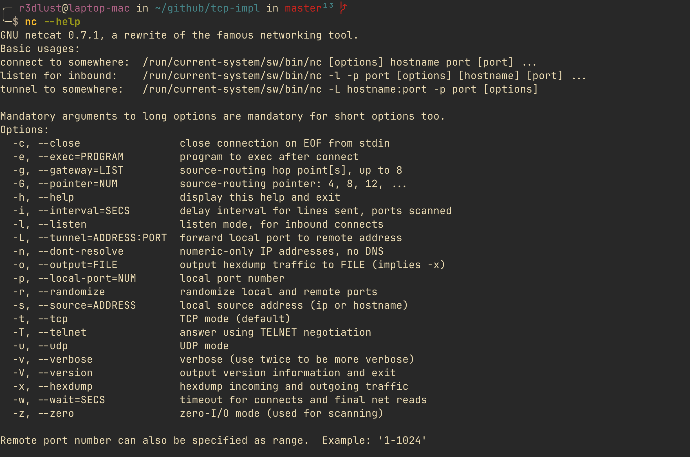
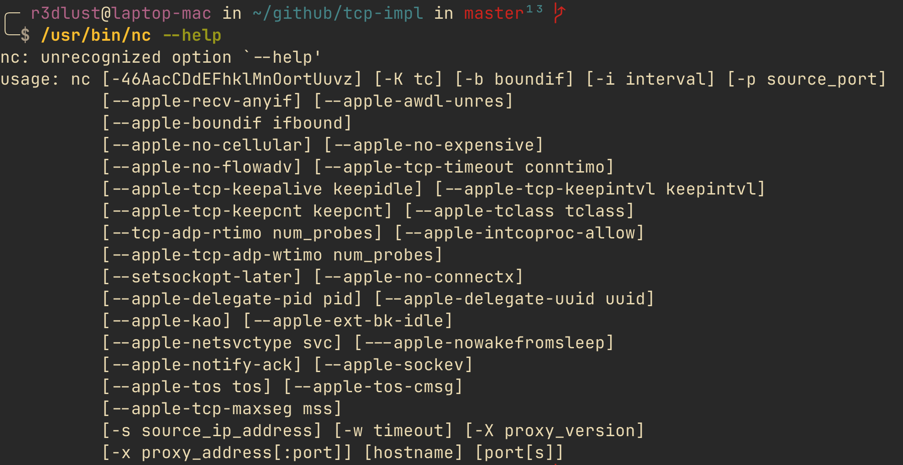
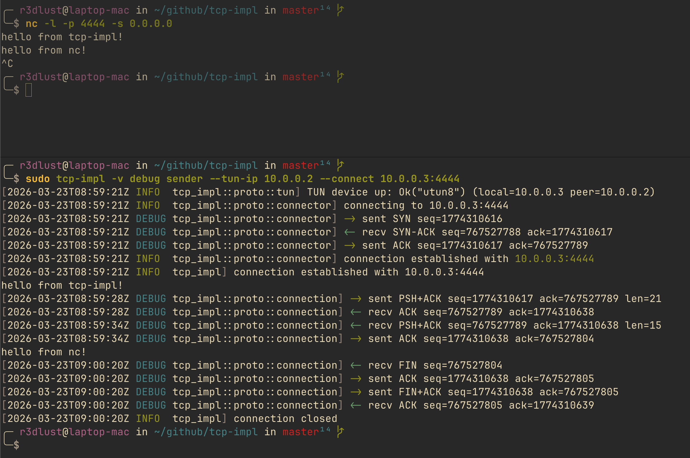

# escrevendo tcp sem a ajuda do kernel

eu esperava a resposta de uma entrevista de emprego e tinha um fim de semana livre. a combinação perigosa.

já tinha construído UDP do zero no ano passado: raw sockets, headers manuais, tudo. esse tinha começado como uma tarefa da faculdade e escapou do controle. esse aqui foi autoinfligido.

TCP é mais difícil. não impossível, mas difícil de jeitos que te surpreendem. o protocolo tem 43 anos e ainda tem cantos que vão silenciosamente arruinar sua tarde se você não prestar atenção.

aqui está o que construí, o que quebrou e o que faria de novo.

## por que tun em vez de raw sockets

o projeto de UDP usou raw sockets. na época pareceu a escolha certa. você tem o socket, escreve os headers, pronto.

mas raw sockets têm um segredo sujo: o kernel ainda processa o tráfego. ele vê seu SYN chegar, verifica se há um socket ouvindo naquela porta, e se não houver, manda um RST. seu segmento artesanal nunca tem chance de respirar.

para UDP isso é gerenciável. para TCP é fatal. o kernel vai RST cada SYN antes que seu código em userspace possa processar.

### o que um dispositivo TUN realmente faz

um dispositivo TUN é uma interface de rede virtual. quando você roteia tráfego por ele, o kernel não processa como uma conexão real. em vez disso, entrega os pacotes IP brutos diretamente no file descriptor que você tem aberto.

```
tráfego para 10.0.0.1 → tabela de roteamento → /dev/net/tun → seu fd → você
```

sem RSTs. sem a pilha TCP do kernel interceptando nada. só bytes chegando em um buffer.

esse é o truque todo.

### o problema do ip companheiro

aqui fica sutil. se você atribuir o endereço local da interface TUN ao IP que quer ownar, o kernel ainda owna aquele IP. ele ainda vai responder por ele.

a correção é um setup ponto-a-ponto:

```rust title="tun.rs"
fn companion_ip(ip: Ipv4Addr) -> Ipv4Addr {
    let [a, b, c, d] = ip.octets();
    let d2 = if d < 255 { d + 1 } else { d - 1 };
    Ipv4Addr::new(a, b, c, d2)
}
```

você passa `--tun-ip 10.0.0.1`. isso vira o endereço **peer**. o kernel roteia tráfego para lá pelo TUN fd em vez de responder diretamente. o endereço local real da interface é `10.0.0.2`. o kernel owna o `.2`, não o `.1`.

```rust title="tun.rs"
config
    .address(local)      // 10.0.0.2 — pertence ao kernel
    .destination(peer)   // 10.0.0.1 — entregue ao seu fd
    .mtu(1500)
    .up();
```

levei uma hora pra descobrir isso pela primeira vez com UDP. implementei corretamente desde o início aqui. pequena vitória.

## a máquina de estados

a RFC 793 define TCP como uma máquina de estados. implementei como uma função pura:

```rust title="connection.rs"
pub fn handle(&mut self, seg: &TcpHeader, payload: &[u8]) -> Vec<TcpAction> {
    if seg.rst {
        self.state = TcpState::Closed;
        return vec![TcpAction::Close];
    }

    match self.state {
        TcpState::Listen if seg.syn && !seg.ack => {
            // SYN recebido → manda SYN-ACK, vai pra SynReceived
            let isn = Self::derive_isn(local_port);
            self.recv_seq = seg.seq_num.wrapping_add(1);
            let hdr = TcpHeader::syn_ack(local_port, remote_port, isn, self.recv_seq);
            vec![TcpAction::Send(hdr, vec![])]
        }
        TcpState::Established if seg.fin => {
            // remoto fechando → ACK no FIN dele, vai pra CloseWait
            self.recv_seq = seg.seq_num.wrapping_add(1);
            self.state = TcpState::CloseWait;
            let ack_hdr = TcpHeader::ack(/* ... */);
            vec![TcpAction::Send(ack_hdr, vec![])]
        }
        // ... e assim por diante para cada transição de estado
        _ => vec![],
    }
}
```

`handle()` recebe um segmento, retorna uma lista de ações (`Send`, `Deliver`, `Close`, `Reset`), e muta o estado da conexão. nada mais. quem chama decide o que fazer com as ações.

### estados que pulei de propósito

esse é o happy path do TCP. sem retransmissão, sem window scaling, sem controle de congestionamento, sem timer `TIME_WAIT` (pulo direto de `FinWait2` pra `Closed`). se um segmento se perde, você simplesmente trava.

tudo bem. o objetivo era entender a máquina de estados, não substituir o kernel.

o que implementei completamente: fechamento simultâneo. quando ambos os lados mandam FIN ao mesmo tempo, você cai em `FinWait1 + FIN` em vez de `FinWait1 + ACK`. o estado `Closing` existe e funciona. fiquei levemente orgulhoso disso.

### o número de sequência inicial

o ISN é derivado do tempo em XOR com a porta local:

```rust title="connection.rs"
fn derive_isn(local_port: u16) -> u32 {
    let secs = SystemTime::now()
        .duration_since(UNIX_EPOCH)
        .map(|d| d.as_secs())
        .unwrap_or(0);
    (secs as u32) ^ (local_port as u32)
}
```

a RFC 793 sugere um ISN baseado em relógio por segurança. isso é baseado em relógio no sentido mais relaxado possível. serve pra uma implementação de brinquedo.

## checksums do zero

TCP exige um checksum one's-complement da RFC 1071 sobre um pseudo-header de 12 bytes mais o segmento TCP. o pseudo-header existe porque endereços IP não ficam no header TCP e você ainda quer detectar erros de roteamento.

```rust title="packet.rs"
pub fn checksum(&self, src: &Ipv4Addr, dst: &Ipv4Addr) -> Result<u16> {
    let tcp_header_bytes = {
        let mut h = self.header.clone();
        h.checksum = 0;  // zera antes de computar
        h.to_bytes()?
    };
    let tcp_length = (tcp_header_bytes.len() + self.payload.len()) as u16;
    let pseudo = TcpPseudoHeader::new(src, dst, tcp_length);  // IP src, IP dst, 0x00, proto=6, tamanho

    let mut buf = Vec::with_capacity(/* total */);
    buf.extend_from_slice(&pseudo.to_bytes()?);
    buf.extend_from_slice(&tcp_header_bytes);
    buf.extend_from_slice(&self.payload);

    Ok(rfc1071_checksum(&buf))
}
```

verificação é simples: rodar o mesmo checksum sobre pseudo-header + segmento recebido deve dar `0x0000`. escrevi um teste pra isso que pegou dois bugs sutis de serialização antes de eu rodar o código contra uma rede real.



os testes foram a decisão certa. escrevi desde o início, para cada serializador de header e construtor de pacote. quando portei pra Linux, os testes me disseram imediatamente quais partes específicas de plataforma quebraram, sem precisar assistir bytes cruzando a rede manualmente.

## três bugs que estragaram o happy path

o happy path básico (conectar, trocar algumas linhas, desconectar) funcionou relativamente rápido. depois comecei a testar casos de borda.

### dados travados até o outro lado falar primeiro

o loop principal inicialmente era assim:

```rust title="connection.rs"
loop {
    let pkt = tun.read_ip_packet()?;  // bloqueia até dados chegarem

    // drena fila de saída e processa pkt
}
```

a thread de stdin enfileirava segmentos de saída via canal mpsc. mas a thread principal estava bloqueada no read do TUN. se você digitasse algo, ficava na fila até o lado remoto mandar algo (como um ACK de mensagem anterior) pra desbloquear o read.

a correção era óbvia quando vi: usar um timeout de 50ms em vez de read bloqueante.

```rust title="connection.rs"
loop {
    // drena fila de saída primeiro
    while let Ok((hdr, payload)) = out_rx.try_recv() {
        // ... envia
    }

    // read não-bloqueante com timeout
    let pkt = tun.read_ip_packet_timeout(Duration::from_millis(50))?;
    // ...
}
```

agora o loop acorda a cada 50ms no mínimo, drena o que estiver enfileirado e processa qualquer pacote recebido. os dois sentidos fluem livremente.

### ctrl+c causa crash em vez de encerrar graciosamente

`libc::poll()` é o que uso para o read com timeout. quando você aperta ctrl+c, o OS entrega `SIGINT` ao processo, que interrompe o `poll()` com `EINTR` (errno 4). eu estava propagando isso como erro:

```
Error: Os { code: 4, kind: Interrupted, message: "Interrupted system call" }
```

a correção foi uma linha:

```rust title="tun.rs"
let ret = unsafe { libc::poll(&mut pfd, 1, timeout_ms) };
if ret < 0 {
    let err = std::io::Error::last_os_error();
    if err.kind() == std::io::ErrorKind::Interrupted {
        return Ok(None);  // trata como timeout, não erro
    }
    return Err(err);
}
```

o crate `ctrlc` seta um `AtomicBool`. o loop principal checa a cada iteração, chama `conn.close()` (manda FIN), e espera o four-way teardown antes de sair. encerramento limpo.

### o fechamento passivo que nunca completa

quando o remoto fecha primeiro (por exemplo, você aperta ctrl+c no `nc`), recebemos um FIN, mandamos ACK e vamos pra `CloseWait`. aí nada acontece. ficamos esperando nosso próprio FIN.

a RFC 793 diz que a aplicação deve chamar close() quando terminar de ler. minha implementação não tinha gatilho automático pra isso. simplesmente ficava em `CloseWait` indefinidamente.

a correção: detectar a transição pra `CloseWait` e imediatamente chamar `close()`.

```rust title="connection.rs"
// depois de processar ações de handle()...
if conn.state == TcpState::CloseWait {
    if let Some(TcpAction::Send(hdr, payload)) = conn.close() {
        // manda FIN, vai pra LastAck
    }
}
```

o fechamento passivo funciona agora. o four-way teardown roda até o fim, estado chega em `Closed`, e o listener re-aceita.



## cross-platform: macOS versus Linux

escrevi isso num mac. funcionou. aí percebi que nunca tinha testado no Linux e meu README já fazia promessas.

Linux acabou sendo mais simples na maioria das coisas, exceto por uma: `nc`.

### o prefixo de 4 bytes que o macOS te impõe

dispositivos TUN do macOS (chamados `utun`) adicionam um prefixo de 4 bytes em cada frame:

```
[0x00, 0x00, 0x00, 0x02] + <header IPv4> + <segmento TCP>
```

esse `0x02` é `AF_INET`. o kernel precisa saber a família de endereços mesmo em um link ponto-a-ponto. você não consegue desligar.

TUN Linux com `IFF_NO_PI` desabilitado te dá IP bruto. sem prefixo nenhum.

a correção foi gating em tempo de compilação:

```rust title="tun.rs"
#[cfg(target_os = "macos")]
const MACOS_AF_INET_PREFIX: [u8; 4] = [0x00, 0x00, 0x00, 0x02];

// leitura:
#[cfg(target_os = "macos")]
{
    let mut buf = vec![0u8; 4 + self.mtu];
    let n = self.inner.read(&mut buf)?;
    if buf[..4] != MACOS_AF_INET_PREFIX { return Ok(None); }
    Ipv4Packet::from_bytes(&buf[4..n])
}

#[cfg(target_os = "linux")]
{
    let mut buf = vec![0u8; self.mtu];
    let n = self.inner.read(&mut buf)?;
    Ipv4Packet::from_bytes(&buf[..n])
}
```

a escrita funciona do mesmo jeito ao contrário. macOS adiciona o prefixo; Linux não. a macro `compile_error!` cobre qualquer coisa que não seja nem um nem outro.

### gnu nc vs bsd nc

essa aqui me custou um tempo.

macOS vem com BSD netcat em `/usr/bin/nc`. por padrão usa IPv4. tudo funciona.

também tenho GNU netcat 0.7.1 instalado. `nc -l 4444` com GNU nc faz bind em `::` (IPv6 any), não em `0.0.0.0`. então quando meu dispositivo TUN manda um SYN IPv4 para `10.0.0.3:4444`, o kernel manda RST porque não há listener IPv4.

GNU nc 0.7.1 também não tem a flag `-4`. o workaround é `-l -p 4444 -s 0.0.0.0`.

passei mais tempo do que deveria tentando entender por que o modo sender "não funcionava" antes de verificar qual `nc` estava rodando.

não posso acreditar que cai nessa. acabei de implementar um protocolo de transporte de 43 anos do zero, acertei o three-way handshake no primeiro teste real, computei checksums RFC 1071 manualmente — e aí fiquei completamente travado por causa do `which nc`. depois de tudo isso, a parte mais difícil do projeto foi o teste.





## o incidente do upgrade do crate tun

em algum momento atualizei o crate `tun` de `0.6` para `0.8` junto com `colored`.

o listener parou de conectar. o sender produziu:

```
skipping non-IPv4 frame: IP version 0
```

acontece que o `tun 0.8` mudou o comportamento de handling do prefixo. agora estava removendo o prefixo na leitura e adicionando na escrita internamente, mas só às vezes, e de forma inconsistente com a documentação da versão. meu handling manual do prefixo estava duplicando na escrita e removendo demais na leitura.

passei cerca de uma hora tentando corrigir antes de decidir que não valia a pena. a API do `0.6` funciona, é estável, e meu código é explícito sobre o que faz. revertei e abandonei os commits ruins via `jj`:

```bash
jj abandon <commit-ruim-1> <commit-ruim-2>
```

às vezes a decisão certa é simplesmente: reverter.

## funciona de verdade




## valeu a pena

sim. mas com ressalva.

essa implementação lida bem com exatamente uma coisa: o happy path. sem retransmissão, sem reordenação, sem window scaling, sem respeitar o buffer do remoto. pilhas TCP reais são bem mais complicadas, e cada bit disso existe por um motivo.

mas o objetivo não era construir uma pilha TCP. era entender uma. e depois desse fim de semana entendo a máquina de estados bem o suficiente para implementá-la novamente de memória, o que é mais do que posso dizer da maioria das coisas que li em livros.

os testes unitários ajudaram mais do que esperava. escrever um teste para cada serializador de header e construtor de pacote antes de rodar qualquer tráfego de rede real significou que as sessões de debug ficaram corrigindo lógica, não typos. o primeiro handshake real funcionou quase imediatamente.

a abordagem TUN versus raw sockets foi a lição certa do projeto UDP. pude ownar os bytes de ponta a ponta sem brigar com o kernel pela propriedade do endereço. quando você entende que a pilha TCP do kernel só vê tráfego endereçado a IPs que ele possui, o truque de roteamento fica óbvio.

esse codebase também é simplesmente melhor do que o udp-impl. esse faz um ano essa semana, e dá pra ver, sem testes, raw sockets, organização de código que fazia sentido na época. tcp-impl tem TDD desde o primeiro dia, hierarquia de módulos de verdade, arquitetura baseada em TUN que não briga com o kernel. é um retrato mais fiel de onde estou hoje como engenheiro Rust do que qualquer coisa que escrevi um ano atrás.

para o código: [github.com/GustavoWidman/tcp-impl](https://github.com/GustavoWidman/tcp-impl)
