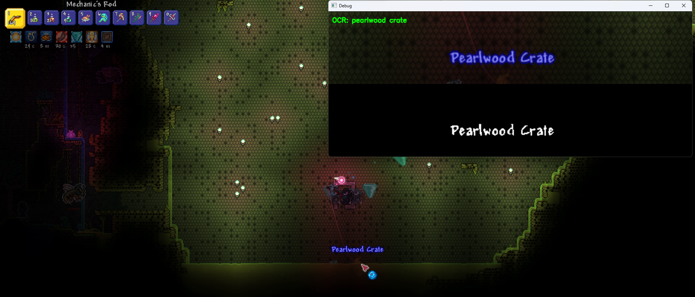
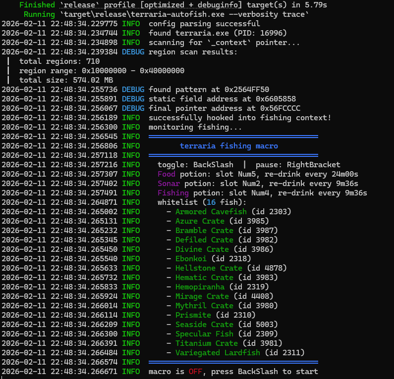

# automatizando a pesca no terraria (porque eu odeio pescar)

um dos meus jogos favoritos, automatizado. voltei a jogar terraria com um amigo nas últimas duas semanas e decidimos que pescar seria divertido. só que eu odeio pescar. eu odeio ficar encarando a tela, odeio clicar, odeio o rng.

então, naturalmente, eu gastei 20x o tempo que levaria para pegar os peixes manualmente para escrever um programa que faz isso por mim.

## tentativa 1: o fracasso da visão computacional

meu primeiro pensamento foi "manter a simplicidade". python + opencv + tesseract ocr. apenas tirar um print do jogo, procurar pelo texto que aparece acima da cabeça quando você pesca algo e clicar.



parecia razoável até eu perceber que a fonte do terraria (`Andy-Bold`) foi desenhada por uma entidade caótica especificamente para quebrar ocr. o kerning é estranho, as bordas são grossas e o jogo renderiza o texto com uma leve oscilação.

além disso, a performance era um lixo. no tempo que o python processava o frame, reconhecia o texto "Honeyfin" e decidia clicar, o peixe já tinha ido embora. perdi mais da metade dos spawns por causa de input lag e tempo de processamento do ocr.

volta à estaca zero.

## tentativa 2: lendo a memória

eu pivotei. e se eu apenas... lesse o id do peixe direto da ram? sem processamento visual, sem latência. apenas dados brutos.

abri o **dnspy**, um debugger e editor de assembly .net, e comecei a fuçar no binário do terraria. como o terraria é escrito em c# (xna/monogame), ele roda no .net clr. isso torna a engenharia reversa mais fácil e mais difícil ao mesmo tempo.

mais fácil porque os metadados são preservados (nomes de funções, nomes de variáveis). mais difícil porque o .net usa um heap fragmentado e garbage collector, então os objetos mudam de lugar na memória constantemente.

eu encontrei o santo graal em `Terraria.Projectile.FishingCheck_RollItemDrop`:


essa função define `fisher.rolledItemDrop` com o id inteiro do peixe que você acabou de fisgar. se eu conseguisse ler esse inteiro, eu saberia exatamente o que estava na linha antes mesmo do jogo renderizar o texto.

### o problema do jit

aqui está a pegadinha: eu não posso simplesmente achar um ponteiro estático para `rolledItemDrop`.

1. **aslr (address space layout randomization)**: o sistema operacional randomiza os locais de memória dos segmentos do programa toda vez que você o executa.
2. **jit (just-in-time) compilation**: o .net compila a linguagem intermediária (il) para código de máquina nativo _em tempo de execução_. o código literalmente não existe em um local fixo até a função ser chamada.

construir uma cadeia de ponteiros (pointer chain) no cheat engine levou mais de 3 horas e quebrou no momento em que reiniciei o jogo. eu precisava de uma abordagem dinâmica.

### pattern scanning no heap

em vez de hardcodar endereços, escrevi um scanner em rust que varre a memória do processo procurando por uma assinatura de bytes específica — a "impressão digital" da função compilada.

eu desmontei (disassemble) `Terraria.Projectile.FishingCheck` para encontrar um ponto de ancoragem estável.


percebi que o código carrega o `FishingContext` de um campo estático `Projectile._context`. o assembly se parece com isso:

```asm
...
55          push ebp
8B EC       mov  ebp, esp
57                    push edi
56                    push esi
50                    push eax
8B F9                 mov  edi, ecx
;     FishingContext context = Projectile._context;
8B 35 ?? ?? ?? ??  mov esi, ds:[addr]  ; <-- o jackpot
;     if (!this.TryBuildFishingContext(context))
8B CF                 mov  ecx, edi
8B D6                 mov  edx, esi
...
```

em rust, repliquei esse scan de assinatura. assim que meu scanner encontra esses bytes, ele extrai o `addr` (a parte `?? ?? ?? ??`).

```rust title="scanner.rs"
// trecho de scanner.rs
let instruction_addr = reader
    .pattern_scan(0x10000000, 0x40000000, &pattern)?;

// lê o offset da instrução mov
let static_addr = reader.read_memory(instruction_addr + 10)?;
```

ler o `static_addr` nos dá um ponteiro para o objeto `FishingContext` no heap. a partir daí, é só aritmética de ponteiros. fiz engenharia reversa do layout da struct e descobri que `rolledItemDrop` vive no offset `0x68`.

então a cadeia final é:
assinatura de `FishingCheck()` -> extrair addr estático de `_context` -> ler ponteiro do heap -> adicionar `0x68` -> `rolledItemDrop`.

## a tecnicalidade do cheat "interno"

eu dei de cara com um bug engraçado imediatamente. eu pegava um bass (id 2290), recolhia a linha, lançava de novo... e o scanner gritava "BASS DETECTED" instantaneamente de novo.

por que? porque `rolledItemDrop` é apenas um endereço de memória. nada limpa ele. ele ainda mantém `2290` da última pesca. como estou monitorando (polling) a memória externamente, não tenho como "hookar" o evento de pesca para saber quando um _novo_ peixe aparece vs o _velho_ ainda sentado lá.

isso me forçou a atualizar de um bot passivo de leitura para um manipulador de memória ativo.

```rust title="reader.rs"
fn zero_memory(&self) -> Result<()> {
    self.reader.write_memory(self.ptr, &0i32)?;
    debug!("zeroed fish memory at 0x{:X}", self.ptr);
    Ok(())
}
```

agora, imediatamente após uma pesca e recolhimento bem-sucedidos, o bot forçadamente escreve `0` naquele endereço de memória. reset de detecção. problema resolvido.

## obsessão por performance

inicialmente, escanear 1gb de memória sequencialmente levava alguns segundos. inaceitável. troquei o iterador padrão pelo `rayon`, a biblioteca de paralelismo de dados do rust.

```rust title="scanner.rs"
// de sequencial para alegria paralela
memory_pages.par_iter().find_any(|page| scan_page(page, pattern))
```

profiling com `samply` mostrou que o loop principal (hot loop) não tinha alocações desnecessárias. o scan caiu de segundos para **milissegundos**. uma vez que o ponteiro é encontrado, o loop de monitoramento roda em **microssegundos**.



## conclusão

funciona. é exagero (overkill). bazuka para matar uma formiga (como sempre). é levemente antiético. mas é o exemplo mais claro que tenho de pensamento a nível de sistemas: profiling com dados reais, entendimento de layouts de memória e padrões disciplinados de unsafe rust.

além disso, nunca mais preciso pescar caixotes (crates) manualmente ;)

confira o código no github: [terraria-autofish](https://github.com/GustavoWidman/terraria-autofish)
