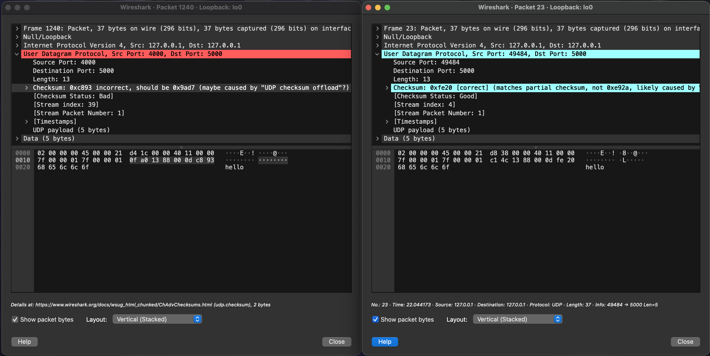
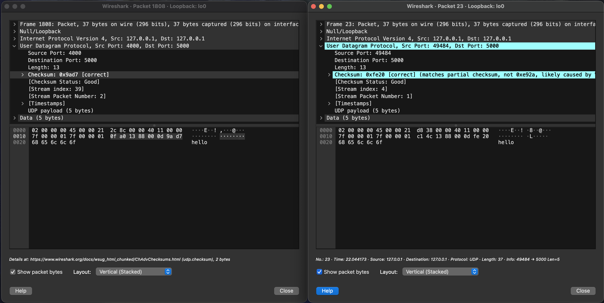
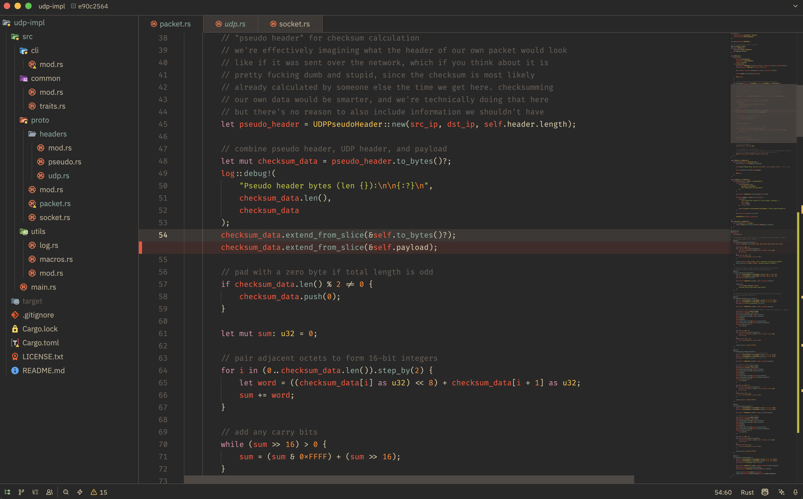

# when a homework assignment becomes a raw socket rabbit hole

it started as a simple college assignment: implement UDP from scratch. the professor said it casually, like it was a weekend thing. and honestly, for most people using C, it probably was.

but i'm not most people. i raised my hand and asked, half-joking: "can i do it in Rust?"

he laughed and said yes.

little did i know.

## the assignment (and why i couldn't leave it alone)

the task was simple enough: build something that can send and receive UDP packets without relying on the OS's UDP socket abstraction. use raw sockets, construct the headers yourself, compute the checksum, and prove it works.

most of my classmates wrote ~200 lines of C, called it a day, and went home. i wrote a modular Rust project with a CLI, custom traits, colored logging, and utility macros. because of course i did.

by that point my classmates already knew me as "the guy who uses Rust and overengineers everything," so this was mostly on-brand.

### the project structure


for what is essentially "send bytes over a socket," this is objectively too much. but i was using this as an excuse to practice Rust modularization. proper module hierarchies, `pub(crate)` visibility, trait-based serialization. the kind of stuff that matters when you're writing real systems code.

### the trait system

two traits drive the whole thing:

```rust title="traits.rs"
pub trait FromBytes {
    fn from_bytes(bytes: &[u8]) -> Result<Self>
    where
        Self: Sized;
}

pub trait ToBytes {
    fn to_bytes(&self) -> Result<Vec<u8>>;
}
```

every protocol structure (the UDP header, the pseudo-header, the full packet) implements both. this made serialization and deserialization consistent across the entire codebase. is it overkill for a homework assignment? absolutely. did it make debugging easier? also absolutely.

## raw sockets: where macOS stops being your friend

### L2 vs L3: a distinction that matters

most tutorials gloss over this, but raw sockets come in two flavors:

- **L3 (network layer) raw sockets**: you construct the IP header and everything above it. the kernel handles the data-link layer.
- **L2 (data-link layer) raw sockets**: you construct _everything_, including the Ethernet header. full control, full responsibility.

for this project, i went with L3. create a `SOCK_RAW` socket with `IPPROTO_UDP`, construct the UDP header and payload, and let the kernel deal with IP and Ethernet. simple enough in theory.

### the `IP_HDRINCL` problem

except macOS is not Linux. macOS is, as one excellent [hackaday article](https://hackaday.com/2024/09/21/when-raw-network-sockets-arent-raw-raw-sockets-in-macos-and-linux/) puts it, essentially FreeBSD with glossy makeup.

on Linux, the `raw(7)` man page makes it clear: `IP_HDRINCL` is set by default for `IPPROTO_RAW` sockets. meaning the kernel expects you to provide the IP header, and it'll handle the rest.

macOS? like FreeBSD, `IP_HDRINCL` is _not_ set by default. the behavior is subtly different, and "subtly different" in systems programming means "you will waste three hours before you read the man page."

### the `sin_len` and `sin_family` saga

then there's the `sockaddr_in` struct. on Linux, `sin_family` is a `u16`. on macOS/BSD, it's a `u8`, and there's an extra `sin_len` field that Linux doesn't have at all.

```rust title="socket.rs"
#[cfg(target_os = "macos")]
sin_len: libc::c_uchar,

#[cfg(target_os = "linux")]
sin_family: u16,
#[cfg(target_os = "macos")]
sin_family: u8,
```

conditional compilation saved me here. but here's the thing: i originally wrote this on Linux. when i tried to compile it on my M3 Max, it just... didn't compile. the Rust compiler straight up refused to build because `sin_len` was missing from the struct initialization.

in C, this kind of thing compiles fine and blows up at runtime. you get a segfault or, worse, silently corrupted data. in Rust, the compiler catches it before you even get to run the thing. no mysterious `errno` values, no staring at wireshark wondering why your packets look wrong. just a clear error message telling you exactly which field is missing.


this is one of those moments where you appreciate Rust. a C programmer might have spent hours debugging a runtime issue that only shows up on macOS. i spent 30 seconds reading a compiler error and adding two lines of `#[cfg]`.

oh, and you need `sudo` to create raw sockets on macOS. so yes, i was running my college homework as root. felt incredibly unofficial.

## the checksum: my nemesis

### RFC 1071 and the pseudo-header

the UDP checksum is computed over a "pseudo-header." it's a fake structure that doesn't actually exist in the packet, used purely for checksum calculation. it includes the source and destination IP addresses, the protocol number (17 for UDP), and the UDP length.

the idea is that the checksum covers the UDP data plus some IP layer context, so if a packet gets delivered to the wrong address, the checksum catches it. clever. also tedious to implement from scratch.

```rust title="pseudo.rs"
pub struct UDPPseudoHeader {
    src_addr: [u8; 4],  // 32 bits
    dst_addr: [u8; 4],  // 32 bits
    zeros: u8,          // 8 bits
    protocol: u8,       // always 17 for UDP
    udp_length: u16,    // length of UDP header + data
}
```

### the algorithm (that drove me insane)

the checksum itself follows RFC 1071: concatenate the pseudo-header, the UDP header (with checksum field set to zero), and the payload. pad to an even length. sum all 16-bit words. fold carries. take the one's complement.

```rust title="packet.rs"
// pair adjacent octets to form 16-bit integers
for i in (0..checksum_data.len()).step_by(2) {
    let word = ((checksum_data[i] as u32) << 8) + checksum_data[i + 1] as u32;
    sum += word;
}

// add any carry bits
while (sum >> 16) > 0 {
    sum = (sum & 0xFFFF) + (sum >> 16);
}

// take 1's complement
let checksum = !(sum as u16);
```

sounds simple when you write it out like that. it was not simple. my first implementation was a naive translation of the RFC, and it produced checksums that were... wrong. just wrong. not crash-level wrong, but "wireshark shows a different value than what i'm computing" wrong.

### the wireshark brute-force debugging arc

this is where things got creative. i couldn't figure out what was off by reading the RFC alone. those documents are precise but not exactly soothing to the ADHD eye. a stackoverflow answer with "do X to fix Y" is a lot easier to process than a 1980s specification written in all-caps.

so i fired up wireshark, sent packets with `nc -u`, and compared the expected checksums byte by byte against what my implementation was producing. basically brute-forcing my way to correctness by staring at hex dumps until the numbers matched.



side-by-side wireshark capture showing a `nc -u` packet with correct checksum vs. a packet from the custom implementation with mismatched checksum.

### the bug that survived a year

when i recently went back to review this code, over a year after writing it, i found that the checksum was _still wrong_. not dramatically wrong, but wrong in a way that most systems silently tolerate.

the bug:

```rust title="packet.rs"
// BEFORE (broken): payload counted twice
checksum_data.extend_from_slice(&self.to_bytes()?);  // header + payload
checksum_data.extend_from_slice(&self.payload);       // payload AGAIN

// AFTER (fixed): just use to_bytes() once
checksum_data.extend_from_slice(&self.to_bytes()?);  // header + payload, done
```

`to_bytes()` on the packet already serializes both the header and the payload. the original code called `to_bytes()` _and then_ appended the payload again separately. the checksum was being computed over pseudo-header + header + payload + payload. double-counted. the fix was just... removing the extra line.

it "worked" because many UDP implementations don't strictly verify incoming checksums, especially on localhost. `nc -u` accepted the packets just fine. the wireshark checksum probably showed a mismatch that i either didn't notice or wrote off as a display quirk.

sometimes bugs survive not because they're hard to find, but because the system is too forgiving to punish them.



## the CLI (because why not)

### clap and subcommands

i used `clap` with derive macros to build a proper CLI with two subcommands: `listener` and `sender`.

```rust title="cli/mod.rs"
#[derive(Subcommand)]
pub enum Subcommands {
    Listener(ListenerArgs),
    Sender(SenderArgs),
}
```

the listener binds to an address and loops forever, printing incoming UDP payloads. the sender reads from stdin and ships each line as a UDP packet. you can pipe stuff into it.

### custom logging

the logging system is probably the most over-the-top part. custom `CologStyle` implementation with mode-aware prefixes, microsecond timestamps, and color-coded log levels.

```
[2025-03-15 14:23:01.123456] [INF] [SENDER] sending packet to 127.0.0.1:5000
```

was this necessary? no. did it make debugging way easier when packets were flying around? yes. and it looked cool in the terminal, which matters more than people admit.

### utility macros

```rust title="macros.rs"
// convenience macro for SocketAddrV4
ipv4!("127.0.0.1:8080")

// timing macro that returns (result, duration)
let (result, elapsed) = timeit!(socket.send(&dst, payload));
```

small quality-of-life stuff. the `timeit!` macro was pretty useful for measuring send latency during testing.

## making it work with `nc -u`

the real test of whether this implementation was correct: could it talk to `nc -u`?

the answer is yes. you can run the sender, point it at a `nc -u` listener, and messages arrive correctly. you can run the listener, send from `nc -u`, and the packets parse and display correctly. interoperability with a standard tool was the goal, and it worked.

```bash
# terminal 1: standard nc listener
nc -u -l 5000

# terminal 2: custom sender (requires sudo on macOS)
sudo cargo run -- sender --bind 127.0.0.1:4000 --addr 127.0.0.1:5000
```

type a message in terminal 2, see it appear in terminal 1. simple. satisfying. worth the hours of debugging.


## what i learned (and what i'd do differently)

### endianness is not optional

every single multi-byte field needs explicit big-endian conversion for network byte order. `.to_be_bytes()` and `.from_be_bytes()` are your best friends. forget one and spend an hour wondering why your port numbers are wrong.

### raw sockets are platform-specific landmines

don't assume Linux behavior on macOS. don't assume macOS behavior on Linux. read the man pages for _your_ platform. the differences are small but they will absolutely ruin your afternoon.

### RFC documents are worth reading (eventually)

they're dense and they're old and they're written in a style that assumes you already know everything. but they are _the_ source of truth. when stackoverflow fails you, the RFC is where you end up.

### checksums are harder than they look

a one's complement sum sounds trivial. it isn't. the pseudo-header adds complexity. byte ordering adds complexity. padding adds complexity. and as i proved, you can get it _almost_ right and have it work for months without noticing the bug.

## closing thoughts

this started as a homework assignment and ended as a lesson in systems programming, cross-platform compatibility, and the humbling experience of getting a checksum wrong for over a year.

was it overengineered? yes. did i learn more from this than from any textbook chapter on UDP? also yes. sometimes the most educational thing you can do is take a simple spec and implement it the hard way. not because it's efficient, but because every mistake teaches you something that `socket.send()` hides behind its abstraction.

the code still works. the checksum is now actually correct. and i still use wireshark more than any sane person should.



check out the repo [here](https://github.com/GustavoWidman/udp-impl).
