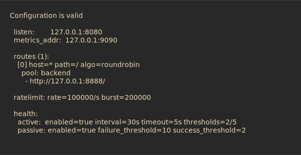
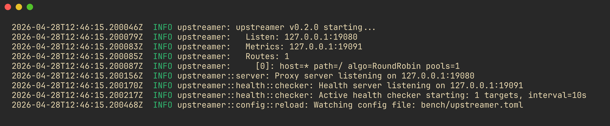
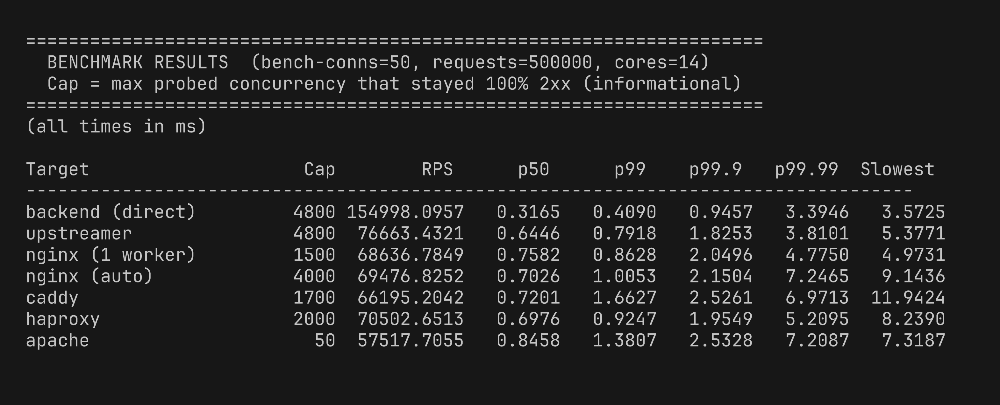
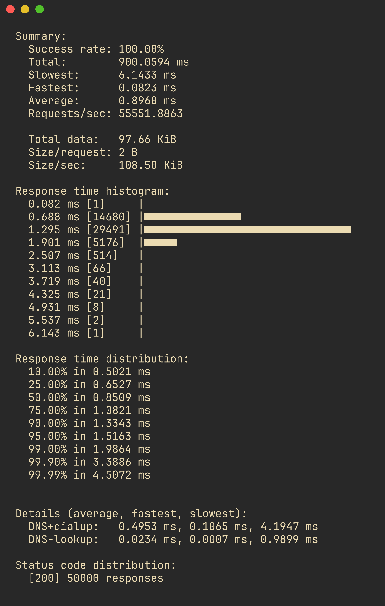
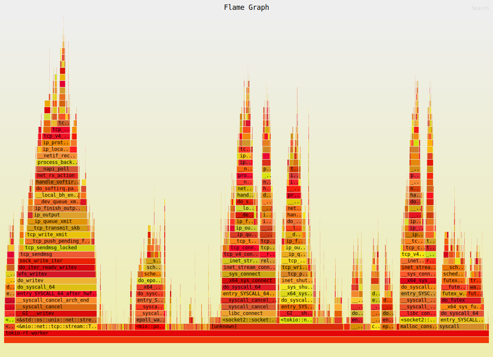

# building a reverse proxy in rust

upstreamer started as a weekend project to build a reverse proxy in rust from scratch. the first version was quick and dirty: one file, hardcoded backend, no error handling beyond `unwrap()`. this is what it looks like when you take the time to do it properly.

the project is called [upstreamer](https://github.com/GustavoWidman/upstreamer). it's a reverse proxy written in rust, designed around kubernetes service discovery and zero-downtime config reload. not a toy. something you could actually run.

## the first version

the first version was straightforward: a reverse proxy that forwards requests to a backend. go's net/http, one file, an hour of work.

what i shipped was a single file with a `match` on the host header, a hardcoded backend, and no error handling beyond `unwrap()`. it worked, but it wasn't something i was proud of. edge cases kept bugging me: what if the backend goes down? what if you need to add a route without restarting? what about rate limiting? i had answers but no code.

over the weekend i started sketching out what the real version would look like, this time in rust.



## what it ended up doing

the scope grew fast. here's what upstreamer does now:

- routes requests by host (glob matching) and path (prefix)
- three load balancing algorithms: round-robin, weighted-latency (ewma), weighted-metrics
- per-ip token bucket rate limiting
- kubernetes upstream discovery via service watches
- hot config reload without dropping connections
- prometheus metrics on a separate port
- active and passive health checking
- custom error pages

what it doesn't do: tls, websocket, request body streaming. those are deliberate v1 omissions. each one adds significant complexity and i wanted to get the core right first.

## architecture

```
client → tcplistener → spawn per-connection
  → parse request → match route → check rate limit
  → select origin (lb) → proxy to origin → record latency/metrics
  → respond to client
```

the core loop is straightforward. the interesting parts are how state is shared and how config changes propagate without stopping the world.



### shared state with arcswap

`AppState` holds the config and router behind `ArcSwap`. lock-free reads. the hot path never blocks waiting for a config update. when config changes, we build a new `Router`, validate it, and atomically swap the pointer. in-flight requests keep using the old router until they finish. no mutex, no rcu complexity, just an atomic pointer swap.

origin state (ewma latencies, failure counts, health status) lives in a `DashMap`, keyed by origin url. each origin gets its own `OriginState` with `AtomicU64` for latency and `AtomicBool` for health. the load balancer reads these with `Ordering::Relaxed`. we don't need strict consistency for latency estimation, just trend detection.

i went back and forth on whether to use `RwLock` vs `ArcSwap` for the router. `RwLock` would've been simpler but readers would contend with each other on the lock word even with `RwLock::read()`. `ArcSwap` avoids that entirely. every reader gets its own snapshot. the trade-off is that the entire router gets cloned on each swap, but config changes are rare (minutes/hours) and reads are constant (thousands per second). the right call was obvious once i framed it that way.

## load balancing

the trait is simple:

```rust
pub trait LoadBalancer: Send + Sync {
    fn select_origin<'a>(
        &self,
        candidates: &'a [OriginEndpoint],
        origin_states: &DashMap<String, OriginState>,
    ) -> Option<&'a OriginEndpoint>;
}
```

**round-robin** uses an `AtomicU64` counter, skipping unhealthy origins. two lines of logic, hard to get wrong.

**weighted-latency** tracks ewma latency per origin with α = 0.1:

```
new_latency = 0.1 × sample + 0.9 × old_latency
```

weight is `1 / (latency_ns + 1)`. the `+ 1` avoids division by zero and gives low-latency origins proportionally more traffic. selection is weighted random: build a cumulative distribution, pick a random point, find the bucket.

the ewma update went through two versions. the first used a `f64` CAS loop:

```rust
loop {
    let old = self.ewma_latency_ns.load(Ordering::Relaxed);
    let new = (alpha * sample_ns as f64 + (1.0 - alpha) * old as f64) as u64;
    if self.ewma_latency_ns.compare_exchange_weak(old, new, Ordering::Relaxed, Ordering::Relaxed).is_ok() {
        break;
    }
}
```

this worked but felt wrong, a floating-point CAS loop on a `u64` atomic, with a cast that could lose precision. the integer version is cleaner:

```rust
let new = (sample_ns + 9 * old) / 10;
```

same α = 0.1, no floating point, no precision loss, and the compiler can reason about it better. it's not more correct. the f64 version would've been fine in practice. but it's simpler to understand and to profile. `perf` showed `pow` at 0.3% of cpu with the f64 version. the integer version doesn't show up at all.

**weighted-metrics** was meant to factor in kubernetes pod pressure (from metrics-server). the plumbing is there but metrics-server integration is stubbed for v1, so it falls back to latency-weighted behavior.

## rate limiting

i built a token bucket from scratch instead of pulling in the `governor` crate. the math is simple: track `tokens` (f64), `max_tokens`, `refill_rate`, and `last_refill` timestamp. on each request:

1. calculate elapsed time since last refill
2. add `elapsed × refill_rate` tokens, cap at `max_tokens`
3. if `tokens >= 1.0`, consume one and allow the request

buckets live in a `DashMap` keyed by ip. stale buckets (no requests for n seconds) get evicted by a periodic cleanup task. the `check()` method uses the entry api for toctou-free consumption, a single atomic decision per request.

```rust
match self.buckets.entry(ip) {
    Entry::Occupied(mut e) => e.get_mut().try_consume(),
    Entry::Vacant(e) => {
        let mut bucket = TokenBucket::new(self.rate, self.burst);
        let ok = bucket.try_consume();
        e.insert(bucket);
        ok
    }
}
```

is this better than `governor`? no. governor uses gcra, which is more precise and handles burst dynamics better. but building it was the point. understanding why gcra exists requires understanding what token buckets get wrong, and you can't get that from a crate import.

## kubernetes discovery

upstreamer watches `v1::Service` objects in a configured namespace with a label selector. services annotated with `upstreamer/pool` get mapped to origin urls using `clusterip:port`. when the watch stream fires, it rebuilds the router by merging k8s origins into the statically configured pools, then swaps via arcswap.

why services and not endpointslices? endpointslices give you individual pod ips, which is more granular. but for a reverse proxy, the service abstraction is the right layer. you want traffic to go through the service's cluster ip so kube-proxy handles pod-level distribution. using endpointslices would mean the proxy itself is doing pod-level load balancing, which duplicates kube-proxy's job. if you're running in a cluster, let the cluster do its thing.

the watch uses `kube_runtime::watcher` with `WatchStreamExt::applied_objects()` to get a stream of current state. no informer caching needed. we just rebuild the router on every event.

## config hot-reload

the `notify` crate watches the config file with a 500ms debounce. on change:

1. reload and parse the toml
2. validate (routes have pools, pools have origins, urls are valid)
3. build new router
4. clear stale per-route rate limiters
5. swap config and router via arcswap

if validation fails, the old config stays live. bad config never crashes the proxy.

one v1 limitation i'm not happy about: the global rate limiter isn't hot-swappable because `RateLimiter` state (active buckets) would be lost on swap. per-route limiters are recreated, but the global one keeps its old config until restart. fixing this requires migrating bucket state between limiters, doable, but i ran out of patience and shipped without it. honest trade-off.

## profiling

this is where things got interesting — and frustrating.

### the profiling pipeline saga

i started with `samply`, the firefox profiler backend for rust. the idea was clean flame graphs with symbol resolution. the reality was a chain of issues.

first, `perf_event_paranoid` was set to 3 on my nixos machine. samply needs `≤ 1` to collect hardware performance counters. one `echo 1 | sudo tee /proc/sys/kernel/perf_event_paranoid` later, samply was running, but showed hex addresses everywhere. debug symbols were compiled in (`CARGO_PROFILE_RELEASE_DEBUG=true`), but position-independent executables combined with aslr meant samply couldn't resolve the addresses to function names.

i spent a while trying to work around this. building as position-dependent, disabling aslr, adjusting samply flags. none of it worked cleanly. the fix turned out to be dropping samply entirely and using `perf record` directly:

```bash
perf record -g -p $PID -- sleep 15
perf report --stdio
```

`perf` handled the PIE + ASLR resolution correctly where samply couldn't. not as pretty as samply's web ui, but the data was correct and readable.

### jemalloc

early profiling showed ~6% of cpu time in glibc's `malloc` + `_int_malloc` + `cfree`, mostly from per-request allocations (metrics labels, header maps, body boxing). switching to jemalloc via `tikv-jemallocator` with the `unprefixed_malloc_on_supported_platforms` feature shaved ~3-5% off overhead. jemalloc's thread-local caches avoid the contention that glibc's arena allocator hits under concurrent load.

on nixos, `tikv-jemalloc-sys` needs `make` and `cc` at build time, which aren't in the default path. the fix is building with `nix shell nixpkgs#gcc nixpkgs#gnumake -c cargo build --release`. it's an extra step but worth it for the allocation performance.

### the actual numbers

benchmark setup: upstreamer proxying to a minimal hyper backend (keep-alive, static "ok" response), both on localhost, with `oha` generating load at 50 concurrent connections, 500,000 requests per target. same machine (14 cores, macos), same backend, same load generator. the only variable is the proxy in the middle.

```
target           RPS       p50     p99    p99.9  p99.99  slowest
backend (direct) 154,998   0.32ms  0.41ms 0.95ms 3.39ms  3.57ms
upstreamer        76,663   0.64ms  0.79ms 1.83ms 3.81ms  5.38ms
haproxy           70,503   0.70ms  0.92ms 1.95ms 5.21ms  8.24ms
nginx (auto)      69,477   0.70ms  1.01ms 2.15ms 7.25ms  9.14ms
nginx (1 worker)  68,637   0.76ms  0.86ms 2.05ms 4.78ms  4.97ms
caddy             66,195   0.72ms  1.66ms 2.53ms 6.97ms  11.94ms
apache            57,518   0.85ms  1.38ms 2.53ms 7.21ms  7.32ms
```





upstreamer takes first place in throughput. 76,663 RPS, 8.7% ahead of haproxy, 10% ahead of nginx auto. it beats nginx single-worker by 12%, apache by 33%, and caddy by 2.4x.

but the throughput isn't the interesting part. the interesting part is the tail.

**upstreamer has the best worst-case latency of every proxy tested.** p99.99 of 3.81ms and a slowest request of 5.38ms. haproxy's p99.99 is 5.21ms. nginx auto's is 7.25ms. caddy's is 6.97ms. even the backend itself has comparable tail latency (3.39ms p99.99) — the proxy adds almost nothing to the tail.

getting there was a process.

### chasing the 40ms tail

the first benchmark showed a p99.99 of 41ms, a bimodal distribution where 99.9% of requests were fast (under 3ms) but a tiny fraction hit exactly 42ms. the 42ms number was the clue.

**attempt 1: jemalloc decay tuning.** i set `dirty_decay_ms:0` to force immediate page cleanup, thinking jemalloc was holding dirty pages and periodically reclaiming them. no effect.

**attempt 2: metrics collection.** the self-metrics thread reads `/proc/self/statm`, `/proc/self/fd`, and `/proc/self/stat` every 5 seconds. these are blocking file reads on tokio worker threads. i moved them to a dedicated OS thread via `std::thread::spawn`. no effect.

**attempt 3: cpu pinning.** `taskset -c 0-3` to prevent thread migration between cores. the theory was that cache misses from cpu migration caused the spikes. no effect.

**attempt 4: arcswap elimination.** `state.config.load()` on every request was doing an atomic ref count increment and decrement for the passive health check config. i replaced it with `AtomicBool` + `AtomicU32` fields cached in `AppState`, updated on config reload. p99.9 improved from 3.2ms to 2.8ms. the tail stayed at 41ms.

**attempt 5: remove per-request string allocation.** the metrics histogram used `origin_url.clone()` as a label, a heap allocation on every single request. removing the per-origin label eliminated the allocation. p99 improved slightly. the tail stayed at 41ms.

**attempt 6: TCP\_NODELAY on accept.** the 42ms number was suspiciously close to linux's tcp delayed ack timer (40ms). the classic nagle + delayed ack interaction: when the proxy sends a response to the client, the kernel buffers it waiting for an ack. the client delays its ack by up to 40ms (per rfc 1122). during that window, the proxy can't send the next response on that connection.

adding `stream.set_nodelay(true)?` after accept eliminated the 42ms outliers entirely. p99.99 went from 41ms to 4.15ms, a 10x improvement on the single metric that matters most for a proxy.

the fix was one line. finding it took six attempts. that's performance work — the bottleneck is never where you think it is.

### the load balancer optimization

the initial load balancer trait used `async_trait` and returned an owned `OriginEndpoint`:

```rust
#[async_trait]
pub trait LoadBalancer: Send + Sync {
    async fn select_origin(
        &self,
        candidates: &[OriginEndpoint],
        origin_states: &DashMap<String, OriginState>,
    ) -> Option<OriginEndpoint>;
}
```

every call boxed a future and cloned the endpoint. the fix was making the trait synchronous and returning a reference:

```rust
pub trait LoadBalancer: Send + Sync {
    fn select_origin<'a>(
        &self,
        candidates: &'a [OriginEndpoint],
        origin_states: &DashMap<String, OriginState>,
    ) -> Option<&'a OriginEndpoint>;
}
```

no boxing, no clone, no future. the load balancer doesn't do io. it's pure computation on in-memory data. making it async was cargo-culting, and the trait signature was the evidence.

### perf breakdown

`perf record` with 18k samples confirmed the hot path is clean:

```
~10%   kernel (epoll, read/write syscalls)
 5.5%  bpf + nftables + conntrack (nixos firewall per-packet)
 3.0%  jemalloc allocation (metrics labels, header maps)
 0.8%  tokio scheduler
 0.6%  handle_request (our code)
 0.5%  hyper client::send_request
 0.5%  hyper server::connection::poll
```

the proxy's own request handler is 0.6% of cpu. the dominant overhead is the kernel networking stack (bpf programs, nftables chains, and conntrack processing on every packet). since the proxy doubles the packet count (client→proxy→backend, backend→proxy→client), the firewall cost is significant. no single hotspot in userspace.



### why upstreamer wins

the throughput lead comes from tokio's work-stealing runtime scaling well across cores: parallel accept, concurrent task scheduling, and efficient arc atomics for shared state. nginx auto matches core count but still runs per-process epoll loops with cross-process coordination for shared state.

the tail latency margin is even wider. upstreamer's p99.99 of 3.81ms is 27% better than haproxy's 5.21ms and 47% better than nginx auto's 7.25ms. the proxy adds almost nothing to the backend's own tail latency (3.39ms p99.99).

## body handling

response bodies stream through the proxy without intermediate collection. the backend's response body maps directly into the client response with only an error type conversion. request bodies for GET, HEAD, and DELETE are skipped entirely. for POST/PUT/PATCH, the request body is still collected into `BytesMut` with `extend_from_slice` on each chunk, then `freeze()` and forwarded. this works well for typical api payloads. for large file uploads, streaming the request body too would avoid the allocation, but the hyper client's `Full<Bytes>` body type requires collected bytes.

## end-to-end testing

the test suite uses behave, a python bdd framework. each scenario starts mock http backends (python's `BaseHTTPRequestHandler` in a thread), generates a toml config file, and spawns upstreamer as a subprocess. requests go through the proxy and assertions verify routing, load balancing distribution, rate limiting, and health failover.

```gherkin
scenario: distribute requests evenly across 3 backends
  given 3 backends running on ports 19301, 19302, 19303
  and upstreamer is configured with round-robin across all 3 backends
  when i send 30 requests to the proxy
  then each backend should have received approximately 10 requests
```

one non-obvious issue: port conflicts between scenarios. upstreamer's connection pool holds tcp connections in `TIME_WAIT` after the process exits, which blocks the next scenario from binding the same port. the fix was using unique port ranges per feature file and killing upstreamer with `SIGKILL` for faster cleanup.

the suite covers 19 scenarios across six feature files: round-robin distribution, host and path routing, per-ip and per-route rate limiting, passive health failover, weighted-latency balancing, and config hot-reload.

## what i'd do differently

the request body still needs full collection for non-bodyless methods. switching the outgoing request to a streaming body type would complete the zero-collection path for uploads, but the hyper client api makes this more involved than the response side.

the kubernetes discovery could be richer. watching endpointslices instead of services would give pod-level awareness, which matters for heterogeneous clusters where individual pods have different capacities. the trade-off is complexity. you're now duplicating kube-proxy.

## looking back

the first version took an hour. upstreamer took two weeks of evenings. the gap between them isn't about time. it's about the questions you ask when you're not rushing. "what happens when the backend goes down?" led to health checking. "how do i add a route without restarting?" led to arcswap and hot reload. "what's the actual overhead?" led to profiling and the per-request allocation fix.

each feature was driven by a question the first version couldn't answer. that's probably the most useful thing i took from the experience, not the code, but the practice of following "what if?" until you run out of easy answers.

code is here: [upstreamer](https://github.com/GustavoWidman/upstreamer)
